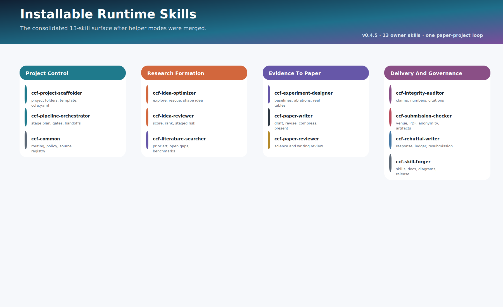
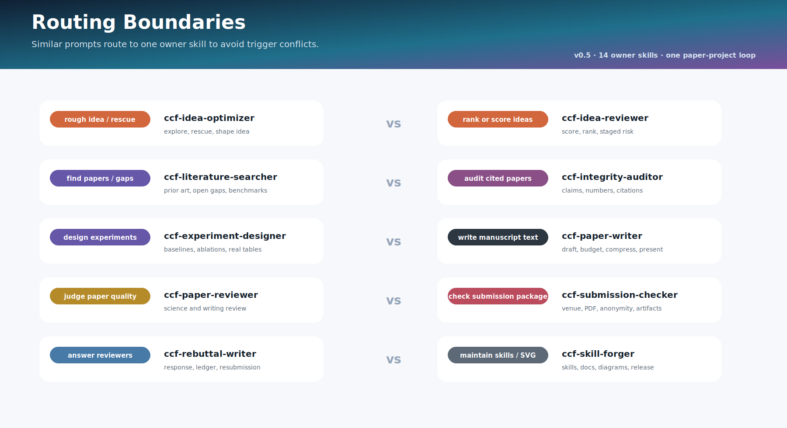
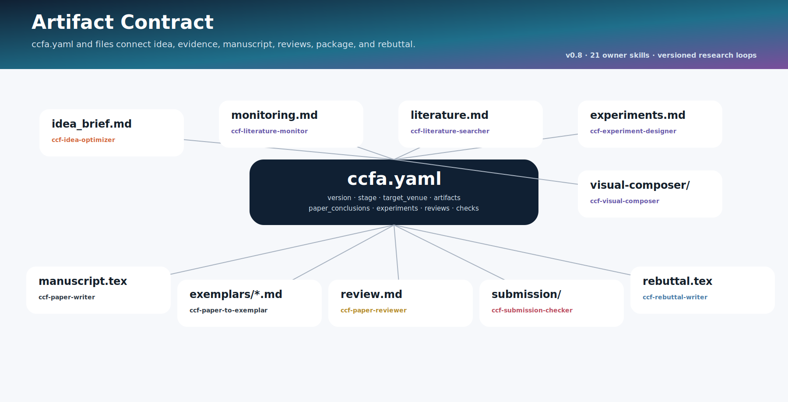
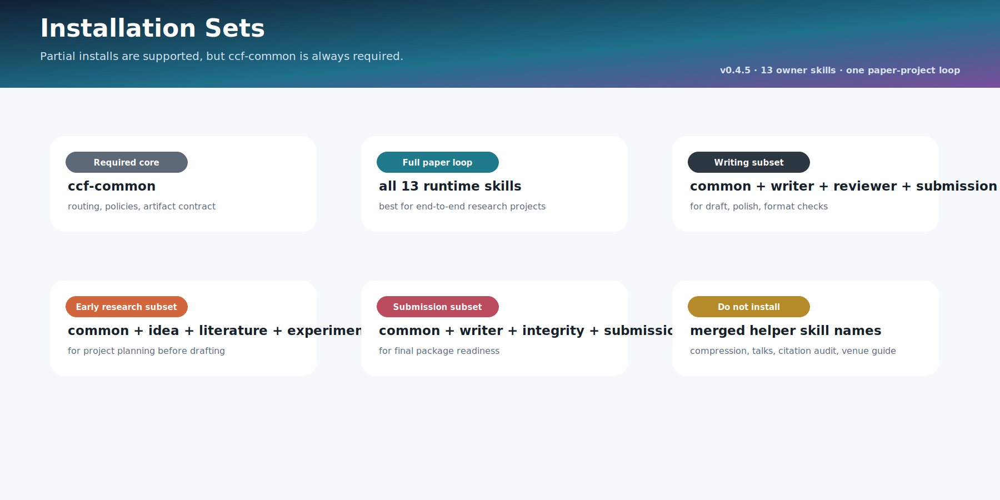
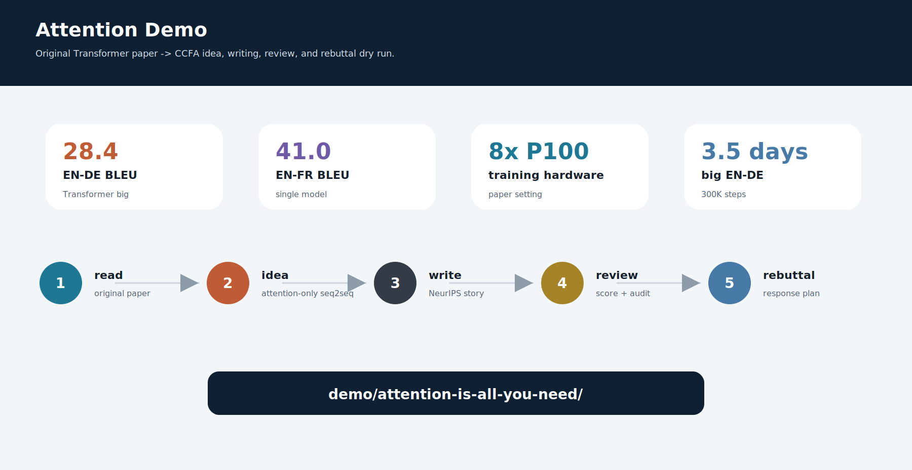

<h1 align="center">CCFA Skills</h1>

<p align="center"><strong>A skill family for shaping the research storyline of CCF-A papers.</strong></p>

<p align="center">
  <a href="README.md">简体中文</a> ·
  <strong>English</strong> ·
  <a href="README.zh-TW.md">繁體中文</a>
</p>

<p align="center">
  
</p>

---

<div align="center">
  <p>
    <span style="color:#334155"><em>"The structure of the prose becomes the structure of the scientific argument."</em></span><br>
    <sub>George D. Gopen and Judith A. Swan, <a href="https://www.cs.tufts.edu/comp/150FP/archive/george-gopen/sci.html"><em>The Science of Scientific Writing</em></a></sub>
  </p>
  <p>
    <span style="color:#2563eb"><em>"The very process of science is centered around communication."</em></span><br>
    <sub>Yann LeCun and James M. Manyika, <a href="https://www.amacad.org/publication/daedalus/learning-abstractions-conversation-yann-lecun"><em>Learning Abstractions</em></a></sub>
  </p>
</div>

A strong paper is rarely defined by the final PDF alone. What matters is the research storyline behind it: an unstable idea finds its position through literature, earns credibility through experiments, becomes a legible argument through writing, and is refined again through review and rebuttal. The hard part is not only drafting one introduction paragraph. The hard part is keeping the idea, evidence, experiments, narrative, and response aligned around the same research question.

CCFA Skills starts from that observation. It treats a CCF-A paper project as a research storyline that can be maintained, audited, and advanced over time, rather than as a one-shot text generation task. An idea should be shaped before it is defended. Experiments should support explicit paper conclusions rather than merely fill tables. Writing should preserve evidence boundaries. A rebuttal should not be an improvised answer at the end of the process, but a traceable bridge to revision and resubmission.

The central insight is that paper quality comes from the quality of continuous decisions. Writing, review, conclusion/evidence audit, submission checking, and rebuttal should not replace one another; they should keep separate responsibilities and hand off through the same project state. The current v0.8 line organizes the family into 19 stage roles, including separate MES-validation and complexity-upgrade loops. Each stage has a clear responsibility, each artifact has a home, and the system behaves more like a collaboration framework around the research storyline than a loose prompt collection. v0.8 also gives `ccf-visual-composer` a bundled Python SVG plotting recipe library for paper-ready visual examples.


## Workflow

The default paper-project loop is:

```text
project scaffold
  -> workflow orchestration
  -> idea optimization
  -> idea review
  -> literature monitoring / competitor tracking
  -> literature search
  -> paper-scenario and formal-problem design
  -> environment implementation audit
  -> algorithm design
  -> algorithm implementation audit
  -> failed-MVP diagnosis and minimal repair when needed
  -> experiment design
  -> visual composition
  -> writing exemplar extraction (optional)
  -> venue-aware writing
  -> scientific/writing review
  -> conclusion/evidence audit
  -> submission package check
  -> rebuttal / revision ledger / resubmission
```

`ccfa.yaml` is the shared project-state file. It records `target_venue`, `stage`, `artifacts`, `paper_conclusions`, `experiments`, `reviews`, `revision_ledger`, and `submission_checks`, so skills can hand off without overwriting each other's files.

### Versioned Design-Validation Loop

Communication work has two independent phase-owned loops. Phase A accepts a complete scientific-problem document, implements and audits a candidate MES/environment, runs one L2 check, implements and audits the initial algorithm, and freezes the anchor only after all evidence passes. Phase B accepts one versioned upgrade document, implements and audits its `stage_case` environment first, then runs, modifies, and repairs the algorithm. It inherits L2, preserves anchor regression, and never creates another MES.

```text
ccf-mes-validation                        [Phase A: problem document -> candidate MES/environment -> initial algorithm -> anchor]
  -> ccf-env-code-auditor / ccf-algorithm-code-auditor
ccf-complexity-upgrade                    [Phase B: upgrade document -> stage_case environment -> algorithm modification/repair]
  -> both independent auditors + anchor regression; no new MES and no L2 rerun
```

Algorithm failure does not authorize a silent change to the environment objective, constraints, task semantics, information pattern, or test settings. An accepted environment semantic change creates a new problem version, preserves the failed version as evidence, and invalidates every dependent algorithm, baseline, and result artifact. At checkpoint commits, invoke the installed `$code-review` skill against the fixed comparison point and accepted specification; CCFA reuses that skill without copying its Standards/Spec rules.


## 19 Runtime Skills

| Stage | Skill | Starts when | Main output | Do not use for |
| --- | --- | --- | --- | --- |
| Setup | `ccf-project-scaffolder` | Create a paper project, copy templates, initialize `ccfa.yaml`. | Project tree, template files, initial state. | Research content generation. |
| Planning/evidence plan | `ccf-pipeline-orchestrator` | Plan stages/gates or, after acceptance, baselines, metrics, ablations, robustness, and result slots. | Workflow plan, conclusion-evidence ledger, `TBD` result plan. | Phase implementation/audit, invented results, visuals, manuscript prose. |
| Idea shaping | `ccf-idea-optimizer` | Explore, rescue, or concretize a rough idea or vague direction. | Problem-gap-insight-method-evidence brief, rescue routes, minimum testable question. | Ranking multiple ideas. |
| Idea gate | `ccf-idea-reviewer` | Explicitly score, rank, stress-test, or triage ideas. | Scores, risks, stage-aware development potential. | Brainstorming or developing one rough idea further. |
| Monitoring | `ccf-literature-monitor` | Track new papers, competitors, arXiv/OpenReview/venue feeds, or ask whether recent work overlaps an idea. | Monitoring report, overlap levels, RELAX/RESEARCH/FOLLOW-UP flags, handoff signals. | Deep related-work search, citation audit, or final idea scoring. |
| Evidence | `ccf-literature-searcher` | Search related work, prior art, datasets, benchmarks, and open gaps. | Literature notes, opportunity map, evidence gaps, related-work structure. | Auditing already cited papers or treating related work as a final idea kill gate. |
| Phase A MES validation | `ccf-mes-validation` | Turn a complete problem document into an audited candidate MES/environment and initial algorithm. | Problem contract, implementations, repair record, frozen accepted anchor. | Later complexity stages or paper-range evidence planning. |
| Environment gate | `ccf-env-code-auditor` | Verify that environment code implements the accepted problem and runs independently. | Traceability evidence, execution evidence, `environment-valid` verdict. | Scenario redesign or algorithm performance judgment. |
| Algorithm gate | `ccf-algorithm-code-auditor` | Verify the algorithm specification against code and independent MVP behavior. | Traceability evidence, reference comparisons, `joint-ready` verdict. | Initial algorithm selection or environment audit. |
| Phase B complexity upgrade | `ccf-complexity-upgrade` | Implement/audit one upgrade document, then modify and repair the algorithm. | Upgrade contract, `stage_case`, environment/algorithm deltas, anchor regressions. | Creating another MES, rerunning L2, changing the anchor, paper-range evidence planning. |
| Visuals | `ccf-visual-composer` | Compose publication-grade figures/tables, Python plotting code, palettes, captions, panel maps, and manuscript integration from supplied results. | Visual contract, plot recipe/code, panel/table map, palette, LaTeX placement, caption plan, render QA ledger. | Designing experiments, inventing results, writing prose as the main task, final submission compliance. |
| Exemplar | `ccf-paper-to-exemplar` | Convert user-provided paper PDFs into reusable writing exemplar cards. | Exemplar cards, writing patterns, venue tags, writer index updates. | Writing papers or performing review. |
| Manuscript | `ccf-paper-writer` | Draft, revise, polish, compress, create venue- and length-aware LaTeX, make presentations. | Manuscript text, format-preserving edits, compressed text, page budget, slides/poster/talk. | Full review, integrity audit, submission check, rebuttal. |
| Review | `ccf-paper-reviewer` | Run scientific review, writing review, scoring, AC/meta-review. | Review report, risk table, revision priorities. | Rewriting the manuscript directly. |
| Conclusion/evidence audit | `ccf-integrity-auditor` | Check supported conclusions, numbers, tables/figures, citations, and BibTeX. | Conclusion/evidence alignment table, numeric consistency report, citation audit. | Broad literature search or full paper review. |
| Submission | `ccf-submission-checker` | Check venue rules, pages, anonymity, PDF metadata, artifacts. | Submission package report, LaTeX/PDF build result, artifact checklist. | Polishing manuscript content. |
| Response | `ccf-rebuttal-writer` | Draft rebuttal, response letter, revision ledger, resubmission plan. | Rebuttal text, reviewer-response table, ledger. | Ordinary manuscript writing. |
| Governance | `ccf-common` | Maintain routing, evidence/privacy policy, source registry, artifact contracts. | Shared policy and validation controls. | Ordinary research tasks. |
| Maintenance | `ccf-skill-forger` | Maintain skills, docs, SVGs, validation, release. | Updated skills, docs, diagrams, release commits. | Research writing, review, experiments. |



## Routing Boundaries

| User intent | Use | Do not use |
| --- | --- | --- |
| Make a rough idea concrete or find a rescue route | `ccf-idea-optimizer` | `ccf-idea-reviewer` |
| Explicitly score, rank, or select ideas | `ccf-idea-reviewer` | `ccf-idea-optimizer` |
| Monitor new papers, competitors, or recent similar ideas | `ccf-literature-monitor` | `ccf-literature-searcher` |
| Find new papers, datasets, benchmarks, or open gaps | `ccf-literature-searcher` | `ccf-integrity-auditor` |
| Implement and accept the initial problem/MES/environment/algorithm from a complete document | `ccf-mes-validation` | `ccf-complexity-upgrade` |
| Implement a post-anchor upgrade document and modify/repair the algorithm | `ccf-complexity-upgrade` | `ccf-mes-validation` |
| Plan baselines, metrics, ablations, robustness, and result evidence after acceptance | `ccf-pipeline-orchestrator` | `ccf-visual-composer` |
| Verify already cited papers | `ccf-integrity-auditor` | `ccf-literature-searcher` |
| Convert a PDF into a writing exemplar | `ccf-paper-to-exemplar` | `ccf-paper-writer` |
| Draft, polish, compress, preserve source format | `ccf-paper-writer` | `ccf-paper-reviewer` |
| Judge acceptance risk | `ccf-paper-reviewer` | `ccf-paper-writer` |
| Check pages, anonymity, PDF, metadata, artifacts | `ccf-submission-checker` | `ccf-paper-writer` |
| Answer reviewers and maintain revision ledger | `ccf-rebuttal-writer` | `ccf-paper-reviewer` |



## Merged Helper Capabilities

Do not install these old names as standalone runtime skills:

```text
ccf-workflow-planner
ccf-env-design
ccf-algorithm-designer
ccf-experiment-debugger
ccf-experiment-designer
ccf-paper-compressor
ccf-writing-reviewer
ccf-citation-auditor
ccf-figure-table-builder
ccf-artifact-packager
ccf-venue-format-guide
ccf-resubmission-adapter
ccf-paper-presenter
ccf-doc-diagram-designer
```

| Merged capability | Current owner |
| --- | --- |
| Workflow planning | `ccf-pipeline-orchestrator` |
| Compression, slides, poster, talk, Q&A | `ccf-paper-writer` |
| Writing review | `ccf-paper-reviewer` |
| Citation audit | `ccf-integrity-auditor` |
| Publication figure/table layout, Python plotting recipes, palettes, captions, render QA | `ccf-visual-composer` |
| Artifact package and venue format | `ccf-submission-checker` |
| Resubmission adaptation | `ccf-rebuttal-writer` |
| Documentation SVGs | `ccf-skill-forger` |

## Artifact Contract



`ccfa.yaml` is a status spine, not the whole paper. Concrete outputs still live in idea briefs, versioned environment and algorithm contracts, validation ledgers, literature notes, experiment plans, visual contracts, Python plotting scripts, manuscripts, review reports, conclusion/evidence audits, submission checks, and revision ledgers. Review and audit skills diagnose; writing changes go back to `ccf-paper-writer`; visual layout and plotting changes go to `ccf-visual-composer`.

## Output Policy

- Writing, polishing, compression, and presentation tasks should follow the user's requested output format.
- If the user provides LaTeX, preserve LaTeX; if the user provides Markdown, preserve Markdown.
- From-scratch manuscript requests read the target venue guide and page budget first; if missing, use the NeurIPS fallback.
- Submission-style full drafts should target the venue's main-body length. Underfilled drafts are expanded by `ccf-paper-writer`; overfilled drafts are compressed by `ccf-paper-writer`; final page compliance is checked by `ccf-submission-checker`.
- Non-review skills should produce concrete, information-dense artifacts.
- Review, audit, and submission-gate skills may remain more structured because their value is traceable diagnosis.
- No skill may invent results, citations, official rules, or reviewer conclusions.


## Venue Guides

Venue-specific LaTeX/template information is reference material:

```text
ccf-paper-writer/references/venue-guides/index.md
ccf-paper-writer/references/venue-guides/<venue>.md
```

Use `ccf-paper-writer` for venue-aware manuscript writing. Use `ccf-submission-checker` for page limits, anonymity, PDF metadata, camera-ready checks, and artifact readiness.

## Install

Full install:

```bash
git clone https://github.com/mikubaka88/CCFA-Skills.git
mkdir -p "$CODEX_HOME/skills"
cp -R CCFA-Skills/ccf-* "$CODEX_HOME/skills/"
```

The full install contains all 19 runtime skills. Install `$code-review` separately when the versioned design-validation loop must review checkpoint commits.

Partial install must include `ccf-common`:

```bash
skills=(ccf-common ccf-paper-writer ccf-visual-composer ccf-paper-reviewer ccf-submission-checker)
mkdir -p "$CODEX_HOME/skills"
for s in "${skills[@]}"; do cp -R "$s" "$CODEX_HOME/skills/"; done
```

PowerShell:

```powershell
$skills = @("ccf-common", "ccf-paper-writer", "ccf-visual-composer", "ccf-paper-reviewer", "ccf-submission-checker")
New-Item -ItemType Directory -Force "$env:CODEX_HOME\skills" | Out-Null
foreach ($s in $skills) { Copy-Item -Recurse -Force $s "$env:CODEX_HOME\skills\" }
```



## Further Reading

To understand why the family is designed this way, read these in order:

| Document | When to read it |
| --- | --- |
| [docs/ARCHITECTURE.md](docs/ARCHITECTURE.md) | Understand the main chain, governance layer, artifact state, and revision loop. |
| [docs/SKILLS_CATALOG.md](docs/SKILLS_CATALOG.md) | Check each skill's startup condition, boundary, and common conflict cases. |
| [docs/INSTALLATION_MATRIX.md](docs/INSTALLATION_MATRIX.md) | Decide which skills are required for partial installation. |
| [docs/NAMING_AND_MERGE_AUDIT.md](docs/NAMING_AND_MERGE_AUDIT.md) | Understand why helper skills were merged and how naming conflicts were reduced. |
| [AGENT_GUIDE.md](AGENT_GUIDE.md) | Operational guide for owner selection, artifact handoff, and overwrite avoidance. |
| [demo/attention-is-all-you-need/](demo/attention-is-all-you-need/) | See a complete ICLR-style closed-loop example. |

## Demo

`demo/attention-is-all-you-need/` is an optional ICLR-style closed-loop demo showing idea extraction, idea review, LaTeX writing, visual-composer SVG plotting examples, review, conclusion/evidence audit, submission check, and rebuttal.



## Validation

```bash
python ccf-common/scripts/check_v04.py
python ccf-common/scripts/check_markdown_links.py
python ccf-common/scripts/check_sources.py
python ccf-common/scripts/check_path_privacy.py .
python tools/build_ccfa_diagrams.py
```
