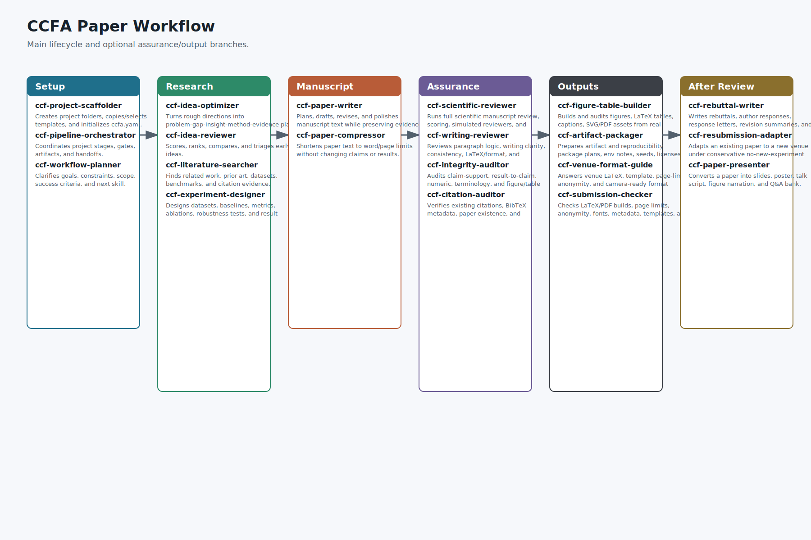
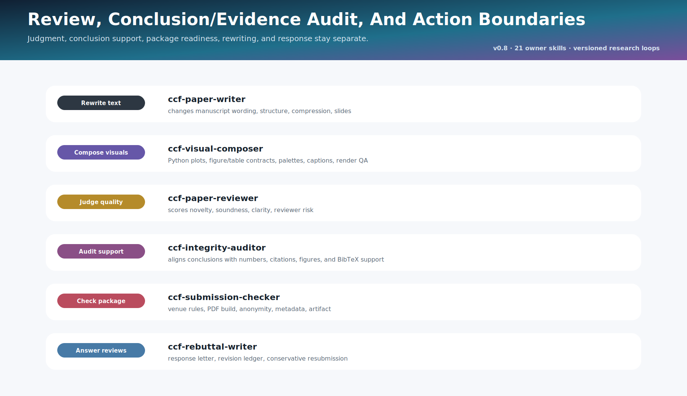

<div align="center">

# CCFA Skills

### A practical skill set for CCF-A research workflows.

<p>
  <strong>English</strong> ·
  <a href="README.zh-CN.md">简体中文</a> ·
  <a href="README.zh-TW.md">繁體中文</a>
</p>

</div>

---

<p align="center">
  
</p>

## Project Orientation

CCFA Skills is a set of local skills for CCF-A-oriented research work. It helps move a project from a rough idea to a defensible submission: clarify the task, shape the idea, find related work, design experiments, write and compress the paper, review it before submission, and respond after reviews.

The repository is not tied to a single model or interface. It follows the `SKILL.md` layout and can be used in environments that support local skills. Most content is Markdown workflows, rubrics, checklists, venue notes, templates, and reference material that can be reused in different local agent setups.

## Research Premise

Many research projects become hard to defend before writing begins. The problem is often an unstable research chain:

```text
problem -> gap -> challenge -> insight -> method -> evidence -> claim
```

When one link is weak, later polishing usually hides the issue instead of fixing it. A vague gap becomes a vague introduction. A method without a clear mechanism becomes a list of components. Experiments that do not test the main claim become hard to defend.

CCFA Skills is organized around a simple habit: find the weak link early, name it clearly, and turn it into the next concrete research action. The style is restrained: grounded novelty, clear mechanism, evidence-backed claims, and honest boundaries.

## System Architecture

The family is organized as a layered research workflow.

| Layer | Purpose | Skills |
| --- | --- | --- |
| **Intake Layer** | Clarify goals, constraints, workflow options, and the next CCFA skill for complex requests. | `ccf-brainstorming` |
| **Idea Layer** | Shape and evaluate a research direction before manuscript writing. | `ccf-idea-optimizer`, `ccf-idea-reviewer` |
| **Evidence Layer** | Search relevant literature and design experiments without inventing results. | `ccf-literature-search`, `ccf-experiment-designer` |
| **Manuscript Layer** | Turn a viable direction into a coherent CCF-A paper and compress it for limits. | `ccf-writing-skills`, `ccf-paper-compressor` |
| **Review Layer** | Review the paper before submission, simulate reviewer concerns, and check writing, format, and LaTeX. | `ccf-conference-reviewer`, `ccf-conference-writing-reviewer` |
| **Response Layer** | Translate reviews into clear author responses and revision commitments. | `ccf-conference-paper-rebuttal` |
| **Maintenance Layer** | Create, refine, validate, and govern skill modules. | `forge-skills`, `ccf-common` |

The workflow is routed by task. `ccf-common/references/routing.md` defines which skill owns each request, so idea optimization, idea scoring, literature search, experiment design, writing, compression, paper review, writing review, rebuttal, and maintenance stay separate.

Cross-skill handoff is controlled by `metadata.ccf_skill_controls.handoff_question_mode`:

- **PARTIAL (Recommended):** ask only for cross-stage transitions, possible idea-scope changes, formal reviewer/rebuttal execution, sensitive browsing, or reusable file generation.
- **FULL:** ask before every optional sibling-skill handoff.
- **OFF:** do not ask; automatically use the routed sibling skill when needed, while still respecting user denylists and writing-only idea-scope protection.

```text
raw idea
  -> ccf-brainstorming                              : optional for ambiguous or multi-stage requests
  -> ccf-idea-optimizer                              : problem / method / evidence plan
  -> ccf-idea-reviewer                               : search-backed strict problem-method gate when scoring/ranking is requested
  -> ccf-literature-search                           : prior art / datasets / benchmarks when current evidence is needed
  -> ccf-experiment-designer                         : baselines / ablations / result-fill tables
       if weak but fixable and handoff allows         : return to optimizer for targeted repair
       if fundamentally misaligned                   : change direction or stop
       if viable and handoff allows                  : writing module becomes available

writing request
  -> ccf-writing-skills                              : writing-only by default
       idea-scope change requires explicit confirm   : otherwise mark Idea-level risk
       length/page compression follows handoff mode   : ccf-paper-compressor
       full scientific review follows handoff mode    : ccf-conference-reviewer
       writing / LaTeX review follows handoff mode    : ccf-conference-writing-reviewer

explicit rebuttal request or real reviews arrive
  -> ccf-conference-paper-rebuttal                   : author response and revision promises
       manuscript rewrite or review-risk diagnosis   : follows handoff mode
```

**Writing-only mode.** `ccf-writing-skills` does not modify the research topic, core problem, method mechanism, experiment setting, reported results, or conclusion direction by default. It may improve expression, structure, storyline, claim-evidence alignment, and reviewer-facing packaging. Idea-level changes require explicit confirmation even if they look helpful.

**Session denylist.** If a user says not to use a skill, that skill is disabled for the conversation. The assistant must not route around the decision by simulating the disabled module; it should use a local fallback such as a compact risk scan, action list, or writing-only checklist.

**Task modes.** CCFA Skills supports `quick` and `standard` modes. `quick` is for one-paragraph polish, short local risk checks, small literature sanity scans, quick experiment sketches, or local compression; it does not force the full checklist. `standard` is the default for full sections, whole-paper reviews, literature folders, experiment plans, score-risk loops, and reusable files.

The second `ccf-idea-optimizer` pass is therefore not duplication. The first pass gives a raw direction enough structure to be judged; a later pass happens after reviewer diagnosis only when the handoff mode permits it. The rebuttal skill is isolated from the default pre-submission loop: it is used only when the user explicitly asks for rebuttal, author response, response letter, or reviewer-comment response.

<p align="center">
  
</p>

<p align="center">
  
</p>

<p align="center">
  
</p>

This structure keeps the main review questions separate: novelty, significance, soundness, evidence, clarity, reproducibility, and venue fit. The skills handle these questions separately while keeping their dependencies visible.

## Skill Family

### `ccf-brainstorming`

Clarifies complex research requests before downstream work. It turns fuzzy goals into a short research brief: the decision to make, audience, available inputs, constraints, success criteria, workflow options, and recommended next CCFA skill.

It is used only when needed. It fits brainstorming, requirements clarification, task decomposition, research-route discussion, or a design brief before choosing the next skill.

### `ccf-idea-optimizer`

Transforms an early research direction into a structured idea plan: task, gap, root challenge, central insight, method mechanism, contribution type, evidence plan, and risks.

It is most useful when an idea is promising but still underdetermined. The skill asks what the project is really trying to establish, what assumption the method relies on, what kind of evidence would make the claim credible, and which venue community would find the work meaningful.

### `ccf-idea-reviewer`

Evaluates the problem and method before the manuscript exists. In standard mode it searches close related work with public-safe queries, compares the idea with prior art, and reviews it from field, method, experiment, venue, and skeptical prior-art perspectives.

Its purpose is to give specific, review-style criticism. It separates low novelty from unknown novelty, feasibility risk from weak positioning, and fixable design issues from reasons to change direction. Major criticisms are tied to the idea claim, the closest evidence, the likely reviewer concern, and a concrete repair condition.

### `ccf-literature-search`

Searches for relevant, higher-quality literature, filters unsuitable sources, classifies paper types, scores paper quality, and writes a literature-search folder with titles, links, scores, paper types, and notes.

It feeds Related Work, Introduction, idea optimization, idea review, experiment design, and reviewer-risk diagnosis. Pure benchmark papers are marked separately rather than penalized for not being method papers.

### `ccf-experiment-designer`

Designs CCF-A experiment plans: datasets, benchmarks, baselines, ablations, metrics, robustness tests, failure analysis, and result-fill tables.

It never fabricates results. When numbers are missing, it provides templates for the user to fill and marks which reviewer concern each experiment answers.

### `ccf-writing-skills`

Develops a viable idea into a paper-level argument. It works through storyline, section planning, paragraph roles, claim-evidence mapping, venue adaptation, writing examples, and revision priorities.

The central discipline is consistency: the abstract, introduction, method, experiments, limitations, and conclusion should all tell the same research story at different resolutions.

### `ccf-paper-compressor`

Compresses paper sections or full manuscripts to a page or word target while protecting the paper story, claims, evidence, results, and limitations.

It can run in quick mode for local shortening or standard mode for full-section/page-limit compression. When appendix-vs-delete choices matter, it asks once and then applies the chosen policy consistently.

### `ccf-conference-reviewer`

Runs a full conference-style paper review. It performs desk checks, public-safe related-work search, novelty, soundness, evidence review, multi-reviewer simulation, AC/meta-review, calibrated scores, concerns tables, and fixed-format Markdown review reports.

Its report format follows the local CSPaper-style reference and adds claim-evidence audit, experiment and reproducibility checks, reviewer panel, AC synthesis, score revision criteria, and next-step routing.

### `ccf-conference-writing-reviewer`

Acts as a writing and format reviewer. It reads the manuscript paragraph by paragraph, checks storyline, LaTeX/format, claim-evidence presentation, consistency, figure/table narration, and contribution display, then turns each issue into a location-specific revision action.

It does not own full scientific review, AC/meta-review, or paper scoring; those route to `ccf-conference-reviewer`.

### `ccf-conference-paper-rebuttal`

Supports post-review author response. It organizes reviewer comments, groups repeated concerns, chooses response strategies, drafts concise replies, and can work with TeX response templates.

The rule is simple: answer the concern, clarify misunderstandings, acknowledge valid limits, and avoid promises that cannot be supported.

### `forge-skills`

Provides the engineering layer for building and maintaining skills. It covers naming, structure, resource organization, validation, and trigger design.

It keeps the family extensible: new domain skills can be added without turning the repository into one large instruction file.

### `ccf-common`

Provides the shared control layer for CCFA routing, handoff modes, private-material safety, source registry, and venue-family mapping. It is not an ordinary research-writing skill; it is loaded by maintainers and sibling skills to keep behavior consistent.

## What The Family Optimizes For

| Objective | Meaning |
| --- | --- |
| **Problem precision** | The paper should name a real bottleneck, not merely report that existing methods are insufficient. |
| **Mechanism clarity** | The method should explain why it works, not only what components it contains. |
| **Novelty grounding** | Claims of originality should be checked against close work and marked uncertain when not yet searched. |
| **Evidence alignment** | Experiments, proofs, studies, or system evaluations should test the central claim. |
| **Venue fit** | The argument should be legible to the intended research community. |
| **Revision continuity** | Criticism should become a clear action list rather than scattered suggestions. |

## Installation

Copy complete skill directories, not only `SKILL.md`. Several modules rely on `references/`, `assets/`, templates, and relative cross-skill references. The installable folders are:

```text
ccf-brainstorming
ccf-idea-optimizer
ccf-idea-reviewer
ccf-literature-search
ccf-experiment-designer
ccf-writing-skills
ccf-paper-compressor
ccf-conference-reviewer
ccf-conference-writing-reviewer
ccf-conference-paper-rebuttal
ccf-common
forge-skills
```

### 1. Codex

Codex-style local skill environments usually read skills from `~/.codex/skills/`. If you use a custom `$CODEX_HOME`, place the folders under `$CODEX_HOME/skills/` instead.

macOS / Linux:

```bash
git clone https://github.com/mikubaka88/CCFA-Skills.git
cd CCFA-Skills
mkdir -p ~/.codex/skills
cp -R ccf-* forge-skills ~/.codex/skills/
```

Windows PowerShell:

```powershell
git clone https://github.com/mikubaka88/CCFA-Skills.git
Set-Location .\CCFA-Skills
New-Item -ItemType Directory -Force "$HOME\.codex\skills" | Out-Null
Copy-Item -Recurse -Force .\ccf-* "$HOME\.codex\skills\"
Copy-Item -Recurse -Force .\forge-skills "$HOME\.codex\skills\"
```

Start a new session after copying. A quick smoke test is: `Use ccf-idea-optimizer to refine this rough research idea...`

### 2. Claude Code

Claude Code can load skills from a user-level skills directory or a project-local skills directory. Use the user-level install when you want CCFA Skills available everywhere; use the project-local install when a paper repository should carry its own research workflow.

User-level install:

```bash
git clone https://github.com/mikubaka88/CCFA-Skills.git
cd CCFA-Skills
mkdir -p ~/.claude/skills
cp -R ccf-* forge-skills ~/.claude/skills/
```

Project-local install:

```bash
git clone https://github.com/mikubaka88/CCFA-Skills.git
mkdir -p your-paper-repo/.claude/skills
cp -R CCFA-Skills/ccf-* CCFA-Skills/forge-skills your-paper-repo/.claude/skills/
```

Windows PowerShell:

```powershell
git clone https://github.com/mikubaka88/CCFA-Skills.git
Set-Location .\CCFA-Skills
New-Item -ItemType Directory -Force "$HOME\.claude\skills" | Out-Null
Copy-Item -Recurse -Force .\ccf-* "$HOME\.claude\skills\"
Copy-Item -Recurse -Force .\forge-skills "$HOME\.claude\skills\"
```

After installation, call a skill by name, for example `/ccf-idea-reviewer`, or ask Claude Code to use the relevant CCFA skill in natural language. If a newly added skill folder is not detected, restart Claude Code.

If you prefer subagent isolation, create Claude Code subagent wrappers that point to these installed skill folders, but keep the `SKILL.md` files and their `references/` directories as the source of truth.

### 3. Other agents or manual use

For other agent frameworks, copy the same folders into the framework's skill, tool, memory, or instruction directory and preserve the relative paths. The agent should treat each `SKILL.md` as the entrypoint for that module.

If the framework has no native skill system, use CCFA Skills manually:

```text
1. Choose the folder that matches the task.
2. Read that folder's SKILL.md first.
3. When SKILL.md mentions references/... or assets/..., resolve the path inside the same folder.
4. When it mentions ../ccf-writing-skills/... or another sibling skill, keep the repository layout intact.
5. Load only the referenced files needed for the current task.
```

To update an installation, run `git pull` in your local clone and copy the skill folders again.

## Example Requests

```text
Use ccf-brainstorming to clarify this broad research workflow and choose the next CCFA skill.
Use ccf-idea-optimizer to refine this rough CVPR idea into a problem-method-evidence plan.
Use ccf-idea-reviewer to rank these NeurIPS directions with closest-work search and strict fatal-risk diagnosis.
Use ccf-literature-search to find and score high-quality related work for my Introduction.
Use ccf-experiment-designer to design datasets, baselines, ablations, and result-fill tables.
Use ccf-writing-skills to rebuild my introduction around the actual contribution.
Use ccf-paper-compressor to reduce this Related Work section to 800 words.
Use ccf-conference-reviewer to run a full NeurIPS-style scientific review and write a fixed Markdown report.
Use ccf-conference-writing-reviewer to review my manuscript paragraph by paragraph for writing logic, LaTeX/format, and consistency before submission.
Use ccf-conference-paper-rebuttal to draft a concise response from these reviews.
```

## Scope

CCFA Skills does not guarantee acceptance, replace experiments, fabricate evidence, or substitute for domain expertise. It is a structured research companion: it helps expose weak assumptions, organize decisions, calibrate claims, and keep the work accountable to the expectations of the target scholarly community.

## Community

For updates, examples, and short research notes, follow Xiaohongshu / RED: `8994074380`.
