<h1 align="center">CCFA Skills</h1>

<p align="center"><strong>A skill family for shaping the research storyline of CCF-A papers.</strong></p>

<p align="center">
  <strong>简体中文</strong> ·
  <a href="README.en.md">English</a> ·
  <a href="README.zh-TW.md">繁體中文</a>
</p>

<p align="center">
  
</p>

---

<div align="center">
  <p>
    <span style="color:#334155"><em>"The structure of the prose becomes the structure of the scientific argument."</em></span><br>
    <sub>George D. Gopen and Judith A. Swan, <a href="https://www.cs.tufts.edu/comp/150FP/archive/george-gopen/sci.html"><em>The Science of Scientific Writing</em></a></sub>
  </p>
  <p>
    <span style="color:#2563eb"><em>"The very process of science is centered around communication."</em></span><br>
    <sub>Yann LeCun and James M. Manyika, <a href="https://www.amacad.org/publication/daedalus/learning-abstractions-conversation-yann-lecun"><em>Learning Abstractions</em></a></sub>
  </p>
</div>

一篇高水平论文真正重要的，往往不是最后那份 PDF，而是贯穿其后的研究故事线。它从一个尚不稳定的 idea 开始，在文献中寻找位置，在实验中接受检验，在写作中被组织成可被审稿人理解的论证，又在评审和 rebuttal 中继续被修正。真正困难的地方，不只是写出某一段 introduction，而是让 idea、证据、实验、表达和回应始终指向同一个研究问题。

CCFA Skills 正是从这个观察出发。它把 CCF-A 论文项目看作一条可以被维护、审计和反复推进的研究故事线，而不是一次性的文本生成任务。一个 idea 需要先被塑形，在真正需要取舍时再接受严格评审；一组实验需要支撑明确的论文结论，而不是孤立地填满表格；一篇论文的写作需要保留证据边界；一次 rebuttal 也不应只是临时答辩，而应成为下一轮修改和重投的可追踪记录。

这个项目的核心 insight 是：论文质量来自连续决策的质量。写作、评审、结论/证据审计、投稿检查和 rebuttal 不应该互相替代，而应该各自保持边界，并在同一个项目状态中交接。当前 v0.8 家族共有 19 个阶段角色，其中包含版本化的环境-算法设计验证闭环。每个阶段都有清楚的责任，每个 artifact 都能找到归属，整套系统更像一个围绕研究故事线展开的协作框架，而不是松散的 prompt 集合。v0.8 还为 `ccf-visual-composer` 增加了内置 Python SVG 绘图配方库，用于生成论文级图表示例。

## 图表与表格能力展示

下面这组图由 `tools/build_visual_showcase.py` 使用固定随机种子生成，测试 `ccf-visual-composer` 的绘图、制表、配色、直接标注和论文级 SVG 输出能力。所有数据均为随机合成，仅用于展示视觉表达。第一组图展示基础图表语法，第二组图展示更接近真实数据分析场景的饼/环图、柱状图、火山图、相关性图和复合 dashboard。

| 示例 | 测试能力 | 视觉策略 |
| --- | --- | --- |
| Conclusion strength ranking | 结论支撑排序图 | 宝石色 lollipop，直接数值标注 |
| Revision lift | 前后对比 | 深蓝/金色 slopegraph，强调变化方向 |
| Evidence coverage | 证据矩阵 | 陶瓷色热力表，兼具图和表的浏览性 |
| Run stability | 随机种子分布 | 紫粉 ridgeline，展示分布形状 |
| Analysis surface | 多指标趋势 | 冷色 small multiples，避免单图拥挤 |
| Submission readiness | 多维状态 | 克制 radial scorecard，作为二级摘要 |
| Opportunity map | 机会空间 | 气泡象限图，表达 novelty/tractability |
| Evidence dashboard | 制表能力 | 表格、条形、风险标签、sparkline 合并 |
| Evidence composition | 饼图/环图 | 陶瓷色比例构成，中心总量和右侧直接图例 |
| Grouped benchmark | 分组柱状图 | 深蓝/金色比较 baseline、ours、oracle |
| Candidate screen | 火山图 | 效应量、显著性阈值和 top hit 标注 |
| Correlation matrix | 相关性分析 | 发散色相关矩阵，保留正负相关数值 |
| Composite dashboard | 复杂复合图 | 环图、柱状图、火山图、相关矩阵组成一张论文级 multi-panel figure |

<table>
  <tr>
    <td width="33%">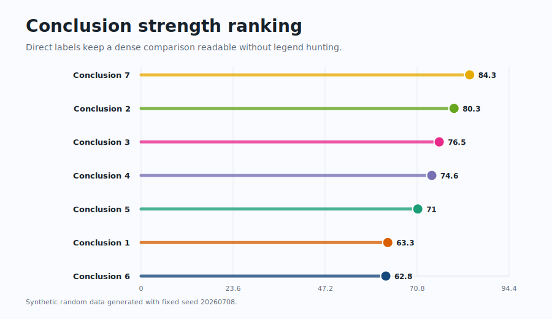</td>
    <td width="33%">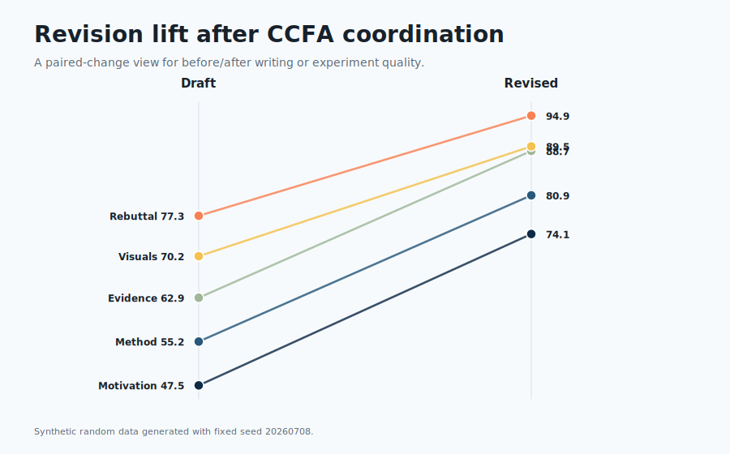</td>
    <td width="33%">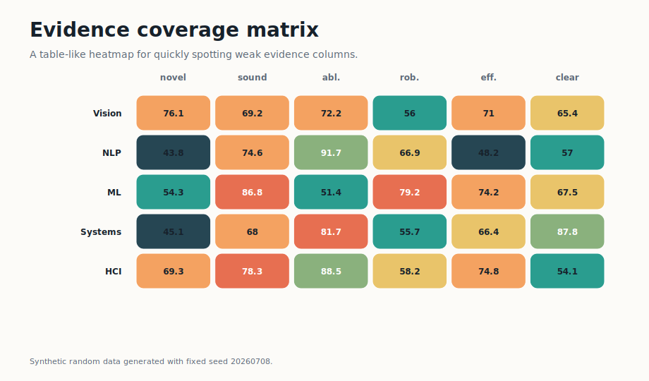</td>
  </tr>
  <tr>
    <td width="33%">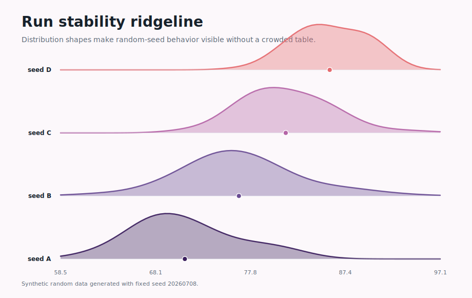</td>
    <td width="33%">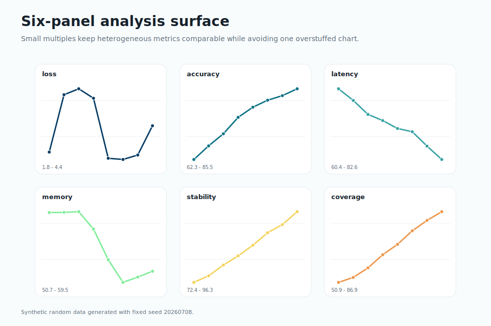</td>
    <td width="33%">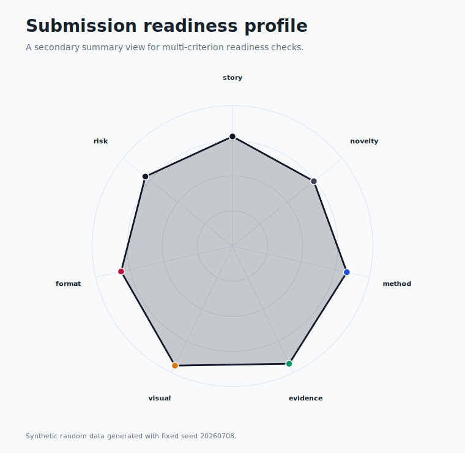</td>
  </tr>
  <tr>
    <td width="33%">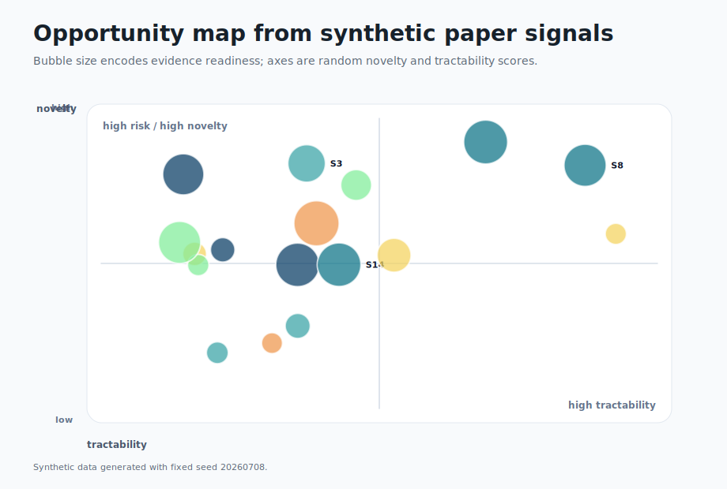</td>
    <td width="33%">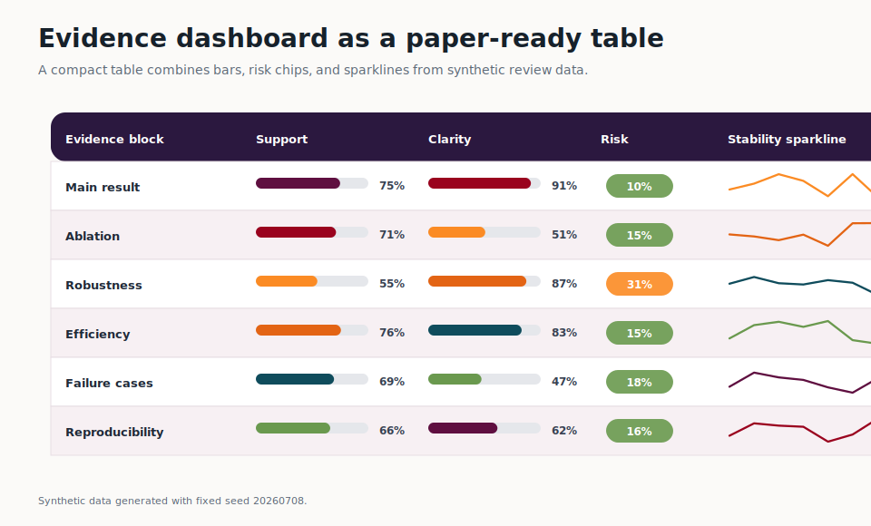</td>
    <td width="33%">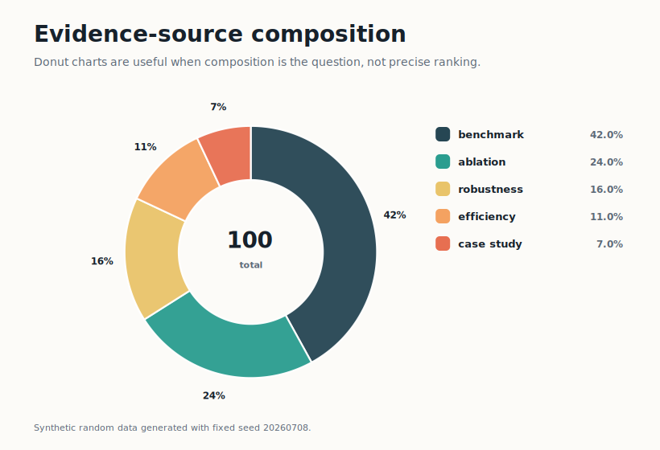</td>
  </tr>
  <tr>
    <td width="25%">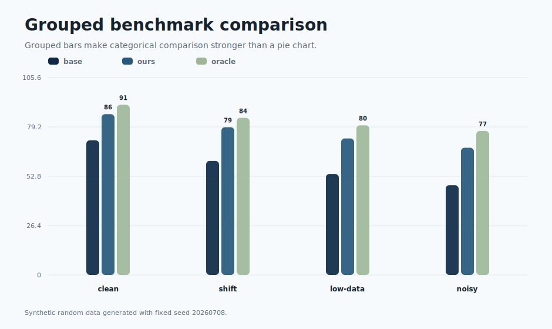</td>
    <td width="25%">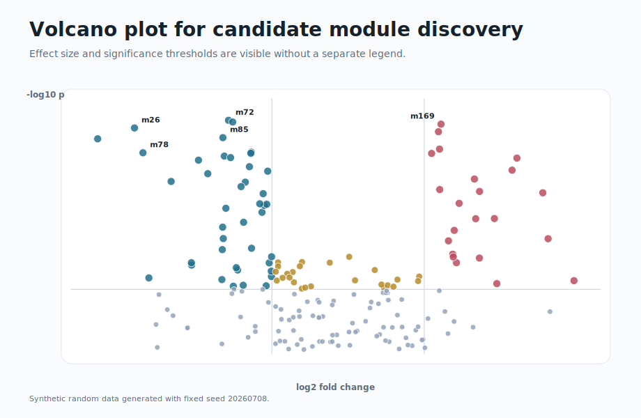</td>
    <td width="25%">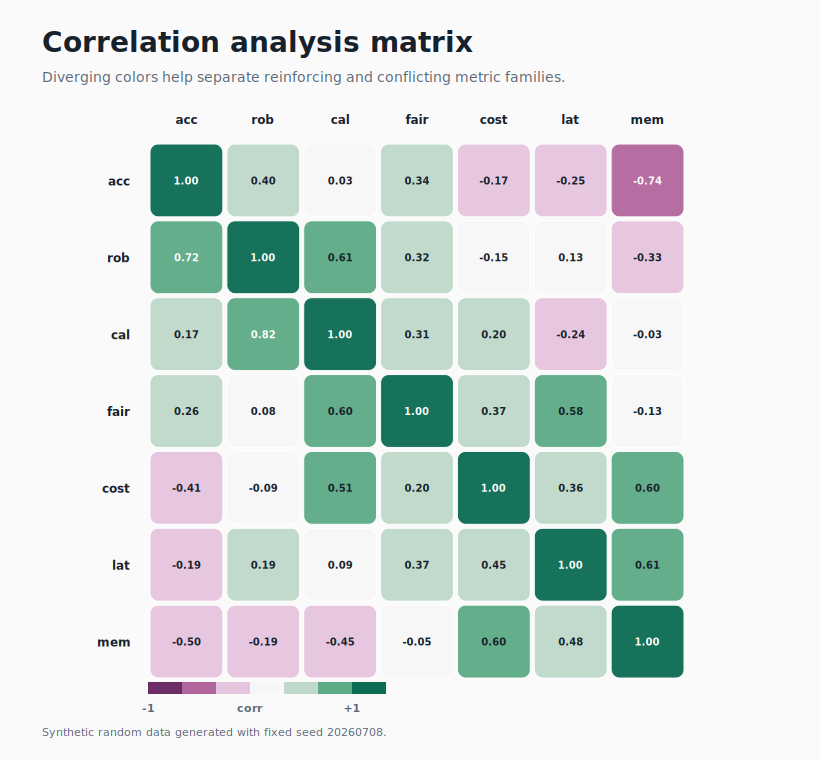</td>
    <td width="25%">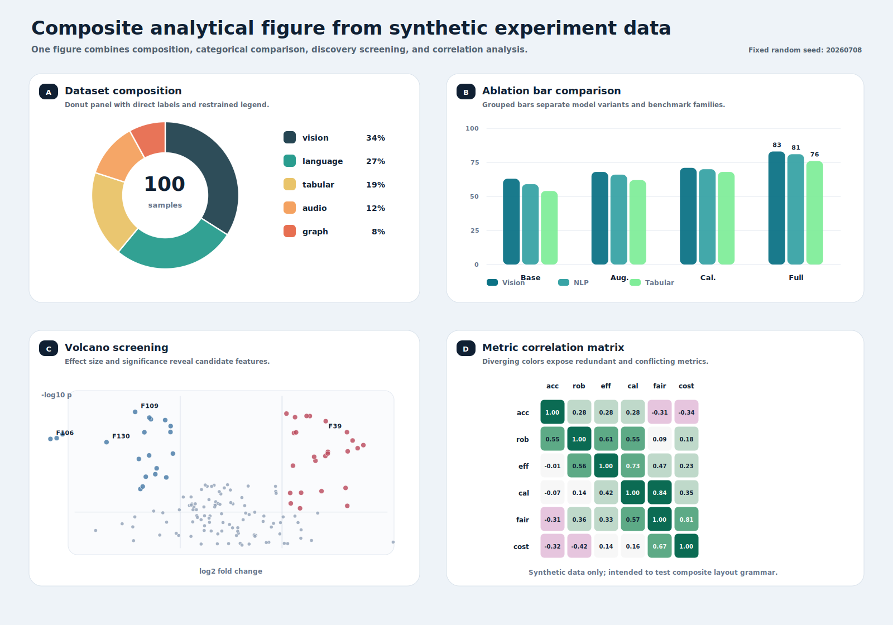</td>
  </tr>
</table>


## 整体链路

默认论文项目闭环如下：

```text
项目搭建
  -> 流程编排
  -> idea 优化
  -> idea 评审
  -> 文献监控 / 竞品跟踪
  -> 文献检索
  -> ccf-mes-validation：完整问题文档、最小但完整的 MES/环境、初始算法、审计与修复、anchor 冻结
  -> ccf-complexity-upgrade：读取现有代码/结果、写升级场景文档、直接修改环境、审计并修改/修复算法；不再创建 MES
  -> ccf-pipeline-orchestrator evidence-plan：baseline、metric、消融、鲁棒性与 TBD 结果计划
  -> 图表视觉整合
  -> 写作范例抽取（可选）
  -> 会议感知写作
  -> 科学/写作评审
  -> 结论/证据审计
  -> 投稿包检查
  -> rebuttal / revision ledger / resubmission
```

每个阶段只交给一个 owner skill。这样做的目的不是减少功能，而是让触发条件、输出格式和 artifact 归属更稳定：写作由 writer 负责，判断由 reviewer 负责，事实核验由 auditor 负责，投稿包由 submission checker 负责，回应审稿人由 rebuttal writer 负责。

`ccfa.yaml` 是共享项目状态文件。它记录 `target_venue`、`stage`、`artifacts`、`paper_conclusions`、`experiments`、`reviews`、`revision_ledger` 和 `submission_checks`，让各个 skill 可以联动，但不会互相覆盖正文、实验表、审稿报告或 rebuttal。

### 版本化设计验证闭环

通信场景和算法分为两个独立阶段。Phase A 接受完整科学问题文档，依次实现最小但完整的 MES/环境、场景审计、初始算法和算法审计/修复，全部通过后才冻结 anchor。Phase B 读取已接受的 MES、现有代码和实验结果，先写一份升级场景文档，再直接按文档修改现有环境并审计，随后修改和修复算法；它不再设计新的 MES，也不要求先运行未经修改的原算法。

```text
ccf-mes-validation                        [Phase A：问题文档 -> candidate MES/环境 -> 初始算法 -> anchor]
  -> ccf-env-code-auditor / ccf-algorithm-code-auditor
ccf-complexity-upgrade                    [Phase B：现有 MES/代码/结果 -> 升级场景文档 -> 修改现有环境 -> 算法修改/修复]
  -> 两个独立 auditor；无新 MES、无需运行未经修改的原算法基线
```

算法失败不能静默改变环境的目标函数、约束、任务语义、信息模式或测试设置。任何被接受的环境语义变更都必须创建新问题版本，保留原失败版本作为证据，并将下游算法、baseline 和结果证据标记为失效，直到受影响 gate 全部重跑。在检查点提交上，使用固定比较点和已接受规格调用已安装的 `$code-review`；CCFA 直接复用该 skill，不复制它的 Standards/Spec 规则。


## 19 个 Runtime Skills

| 阶段 | Skill | 启动条件 | 主要产物 | 不应该用于 |
| --- | --- | --- | --- | --- |
| 项目搭建 | `ccf-project-scaffolder` | 用户要创建论文项目目录、复制模板、初始化 `ccfa.yaml`。 | 项目目录、模板文件、初始状态文件。 | 生成研究内容或替用户写 idea。 |
| 流程/证据计划 | `ccf-pipeline-orchestrator` | 用户要拆任务、排阶段、设 gate，或在阶段通过后设计 baseline、metric、消融和鲁棒性证据。 | 阶段计划、handoff、结论-证据 ledger、TBD 结果计划。 | 实现/审计阶段代码、编造结果、绘图或写正文。 |
| Idea 优化 | `ccf-idea-optimizer` | 用户有粗 idea、模糊方向、想找方向或救方向。 | problem-gap-insight-method-evidence 文档、救援路线、最小可验证问题。 | 对多个 idea 排名打分。 |
| Idea 评审 | `ccf-idea-reviewer` | 用户明确要求评分、排名、严格评审、判断创新性或取舍。 | 分数、风险、stage-aware 发展潜力、修改建议。 | 继续发散优化单个 idea。 |
| 文献监控 | `ccf-literature-monitor` | 用户要追踪新论文、竞品、arXiv/OpenReview/会议动态，或问最近有没有类似 idea。 | 监控报告、overlap level、RELAX/RESEARCH/FOLLOW-UP 标记、跨 skill handoff。 | 系统性 related work 检索、引用审计或最终 idea 打分。 |
| 文献证据 | `ccf-literature-searcher` | 用户要查 related work、prior art、数据集、benchmark、open gap 或引用证据。 | 文献列表、筛选理由、相关工作结构、机会图、证据缺口。 | 只核验已经写进论文的引用，或把 related work 当成最终否决。 |
| Phase A MES 验证 | `ccf-mes-validation` | 用户要从完整问题文档完成最小但完整的 MES/环境、初始算法、审计和修复闭环。 | 问题合同、环境/算法实现、Phase-A 记录和冻结 anchor。 | 后续场景升级或论文范围证据计划。 |
| 环境实现 gate | `ccf-env-code-auditor` | 用户要核验环境代码是否实现已接受问题并可独立运行。 | 设计到代码追踪、执行证据和环境审计结果。 | 重设计场景或判断算法性能。 |
| 算法实现 gate | `ccf-algorithm-code-auditor` | 用户要核验初始或升级算法的规格、代码实现与独立参照行为。 | 设计到代码追踪、参照比较和算法审计结果。 | 算法选择、实现或环境审计。 |
| Phase B 复杂度升级 | `ccf-complexity-upgrade` | 用户要根据现有代码和结果写升级场景文档，直接修改/审查环境，再修改和修复算法。 | 升级文档、环境/算法增量、审计和 Phase-B 记录。 | 创建新 MES、先跑未经修改的原算法基线、修改 anchor 或论文范围证据计划。 |
| 图表呈现 | `ccf-visual-composer` | 用户要基于已提供结果做论文图表排版、Python 绘图代码、创意数据分析图、配色、多面板 figure、表格版式、caption 或正文嵌入。 | visual contract、plot recipe/code、panel/table map、palette、LaTeX placement、caption plan、render QA ledger。 | 设计实验、编造结果、主写正文或最终投稿合规。 |
| 写作范例 | `ccf-paper-to-exemplar` | 用户提供论文 PDF，希望抽取成可复用写作范例或个人 exemplar 库。 | exemplar card、写作 pattern、venue 标签、writer 可用索引。 | 直接写论文或进行审稿。 |
| 论文写作 | `ccf-paper-writer` | 用户要写、润色、压缩、改写、从 idea 起草 LaTeX、按目标会议篇幅成稿、做 slides/poster/talk。 | 论文正文、保留格式的修改稿、压缩稿、篇幅预算、展示材料。 | 完整审稿、事实审计、投稿包检查或 rebuttal。 |
| 论文评审 | `ccf-paper-reviewer` | 用户要科学审稿、写作评审、评分、AC/meta-review 或投稿风险诊断。 | 科学评审、写作评审、风险表、评分和修改优先级。 | 直接替换正文或写 rebuttal。 |
| 结论/证据审计 | `ccf-integrity-auditor` | 用户要核验论文结论、数字、图表、引用、BibTeX 和上下文支撑。 | 结论-证据一致性表、数字一致性报告、引用审计。 | broad literature search 或完整科学审稿。 |
| 投稿检查 | `ccf-submission-checker` | 用户要查会议规则、页数、匿名、PDF metadata、artifact、camera-ready。 | 投稿包检查、LaTeX/PDF 构建结果、匿名和 artifact checklist。 | 润色正文内容。 |
| 审稿回复 | `ccf-rebuttal-writer` | 用户要写 rebuttal、response letter、revision ledger 或重投计划。 | rebuttal 文案、逐条回应、revision ledger、resubmission plan。 | 普通论文写作。 |
| 共享治理 | `ccf-common` | 维护路由、隐私/证据策略、source registry、artifact contract。 | 公共规则、路由表、source registry、校验策略。 | 普通研究任务。 |
| 家族维护 | `ccf-skill-forger` | 维护 skill、命名、docs、SVG、校验、release。 | 更新后的技能文件、文档、图、验证结果和发布提交。 | 研究写作、审稿或实验设计。 |


## 触发边界

触发边界是这个家族最重要的治理点。相似任务必须进入不同 owner，避免一个请求同时触发多个 skill。

| 用户真正要做的事 | 使用 | 不使用 |
| --- | --- | --- |
| 把一个模糊 idea 变成可做的研究方案，或找救援路线 | `ccf-idea-optimizer` | `ccf-idea-reviewer` |
| 明确要对多个 idea 打分、排序、取舍 | `ccf-idea-reviewer` | `ccf-idea-optimizer` |
| 监控新论文、竞品、最近是否有类似 idea | `ccf-literature-monitor` | `ccf-literature-searcher` |
| 找新文献、找 benchmark、找数据集、找 open gap | `ccf-literature-searcher` | `ccf-integrity-auditor` |
| 从完整科学问题文档实现并验收 MES、环境和初始算法 | `ccf-mes-validation` | `ccf-complexity-upgrade` |
| 在冻结 anchor 上根据升级请求生成场景文档，再修改/审计现有环境和算法 | `ccf-complexity-upgrade` | `ccf-mes-validation` |
| 阶段通过后规划 baseline、metric、消融、鲁棒性和结果证据 | `ccf-pipeline-orchestrator` | `ccf-visual-composer` |
| 核验论文里已经引用的文献是否真实支撑论文结论 | `ccf-integrity-auditor` | `ccf-literature-searcher` |
| 把 PDF 论文转成写作范例 | `ccf-paper-to-exemplar` | `ccf-paper-writer` |
| 写正文、润色、压缩、保持原格式改写 | `ccf-paper-writer` | `ccf-paper-reviewer` |
| 判断论文能否被接收、哪里会被拒 | `ccf-paper-reviewer` | `ccf-paper-writer` |
| 检查页数、匿名、PDF、metadata、artifact | `ccf-submission-checker` | `ccf-paper-writer` |
| 回复审稿人和维护 revision ledger | `ccf-rebuttal-writer` | `ccf-paper-reviewer` |


## 已合并的 Helper 能力

这些旧名称不要再作为独立 runtime skills 安装：

```text
ccf-workflow-planner
ccf-env-design
ccf-algorithm-designer
ccf-experiment-debugger
ccf-experiment-designer
ccf-paper-compressor
ccf-writing-reviewer
ccf-citation-auditor
ccf-figure-table-builder
ccf-artifact-packager
ccf-venue-format-guide
ccf-resubmission-adapter
ccf-paper-presenter
ccf-doc-diagram-designer
```

能力仍然存在，只是归属到更合适的 owner：

| 已合并能力 | 当前 owner | 原因 |
| --- | --- | --- |
| workflow planning | `ccf-pipeline-orchestrator` | 规划和编排必须共享同一个阶段状态。 |
| compression、slides、poster、talk、Q&A | `ccf-paper-writer` | 都属于论文文本或论文派生文本。 |
| writing review | `ccf-paper-reviewer` | 它是评审模式，不是写作模式。 |
| citation audit | `ccf-integrity-auditor` | 核验引用属于事实完整性。 |
| artifact packager、venue format guide | `ccf-submission-checker` | 都属于投稿包 readiness。 |
| resubmission adapter | `ccf-rebuttal-writer` | 重投需要基于 reviewer response 和 revision ledger。 |
| docs SVG designer | `ccf-skill-forger` | 文档图是家族维护，不是论文实验图。 |

## Artifact 合约

CCFA 的 artifact 设计是为了避免 skill 互相覆盖。

| Artifact | 主要 owner | 其他 skill 如何使用 |
| --- | --- | --- |
| `ccfa.yaml` | `ccf-project-scaffolder`, `ccf-pipeline-orchestrator` | 读取阶段、目标会议、产物状态和 gate。 |
| idea brief | `ccf-idea-optimizer` | reviewer 评分，writer 用于正文 story。 |
| idea review | `ccf-idea-reviewer` | optimizer 和 experiment designer 用于修正方向。 |
| literature notes | `ccf-literature-searcher` | writer 写 related work，auditor 检查引用支撑。 |
| visual contracts/figures/tables/plot scripts | `ccf-visual-composer` | writer 连接正文叙事，auditor 查数字一致性，submission checker 查最终格式。 |
| manuscript | `ccf-paper-writer` | reviewer/auditor/submission checker 只诊断或检查。 |
| review report | `ccf-paper-reviewer` | writer 修稿，rebuttal writer 提取回应点。 |
| conclusion/evidence audit | `ccf-integrity-auditor` | writer 收紧结论，literature searcher 补证据。 |
| submission check | `ccf-submission-checker` | writer 修格式，rebuttal writer 准备后续版本。 |
| revision ledger | `ccf-rebuttal-writer` | orchestrator 跟踪 reviewer comment 到 action 的闭环。 |


## 写作与评审输出原则

- 写作、润色、压缩、presentation 任务应服从用户要求的输出格式。用户给 LaTeX 就保持 LaTeX，给 Markdown 就保持 Markdown。
- 用户只有 idea 且要求从 0 写文章时，`ccf-paper-writer` 先读取目标会议 venue guide 和篇幅预算；如果没有目标会议或找不到 guide，回退 NeurIPS 模板。
- 投稿式完整稿件不能只求可编译：应接近目标会议主文篇幅，短太多要扩写，超出篇幅再由 writer 的 compression 模式压缩，最后交给 `ccf-submission-checker` 检查页数。
- 非 review 类 skill 应该灵活、信息密度高，产出具体 artifact，而不是空泛流程说明。
- review、audit、submission gate 可以保持严格结构，因为它们的价值是可追踪的判断、风险和 pass/fail 检查。
- 所有 skill 都不能编造实验结果、引用、官方规则或 reviewer 结论。缺证据时应标明 `TBD`、`needs evidence` 或交给对应 owner。


## Venue Guides

会议 LaTeX/template 信息是 reference，不是 runtime skill：

```text
ccf-paper-writer/references/venue-guides/index.md
ccf-paper-writer/references/venue-guides/<venue>.md
```

使用规则：

| 场景 | 使用 |
| --- | --- |
| 按 ICLR/NeurIPS/CVPR 等目标会议写正文 | `ccf-paper-writer` 先读 venue guide，再写正文。 |
| 检查页数、匿名、PDF metadata、camera-ready、artifact | `ccf-submission-checker`。 |
| 只问某会议 LaTeX/template/page limit | `ccf-submission-checker`，必要时读取 venue guide。 |
| 找不到目标会议 guide | `ccf-paper-writer` 默认回退 NeurIPS 模板，并提示最终投稿前需重新核验。 |

## 安装

完整安装：

```bash
git clone https://github.com/mikubaka88/CCFA-Skills.git
mkdir -p "$CODEX_HOME/skills"
cp -R CCFA-Skills/ccf-* "$CODEX_HOME/skills/"
```

部分安装必须包含 `ccf-common`：

```bash
skills=(ccf-common ccf-paper-writer ccf-visual-composer ccf-paper-reviewer ccf-submission-checker)
mkdir -p "$CODEX_HOME/skills"
for s in "${skills[@]}"; do cp -R "$s" "$CODEX_HOME/skills/"; done
```

PowerShell：

```powershell
$skills = @("ccf-common", "ccf-paper-writer", "ccf-visual-composer", "ccf-paper-reviewer", "ccf-submission-checker")
New-Item -ItemType Directory -Force "$env:CODEX_HOME\skills" | Out-Null
foreach ($s in $skills) { Copy-Item -Recurse -Force $s "$env:CODEX_HOME\skills\" }
```

推荐安装组合：

| 组合 | 包含 | 适合 |
| --- | --- | --- |
| 全流程 | 19 个 runtime skills | 从 idea、版本化设计验证到 rebuttal 的完整论文项目。 |
| 写作子集 | `ccf-common`, `ccf-paper-writer`, `ccf-visual-composer`, `ccf-paper-reviewer`, `ccf-submission-checker` | 起草、润色、图表视觉整合、写作评审、格式检查。 |
| 监控子集 | `ccf-common`, `ccf-literature-monitor`, `ccf-literature-searcher`, `ccf-idea-reviewer`, `ccf-idea-optimizer` | 追踪新论文、竞品和 novelty 风险。 |
| 投稿子集 | `ccf-common`, `ccf-paper-writer`, `ccf-visual-composer`, `ccf-integrity-auditor`, `ccf-submission-checker` | 已有稿件的完整性、图表展示和投稿包检查。 |
| 维护子集 | `ccf-common`, `ccf-skill-forger` | 维护技能、文档、SVG 和 release。 |


## 进一步阅读

如果你想理解这个家族为什么这样设计，建议按下面顺序阅读：

| 文档 | 适合什么时候看 |
| --- | --- |
| [docs/ARCHITECTURE.md](docs/ARCHITECTURE.md) | 想理解主链路、治理层、artifact 状态和 revision loop。 |
| [docs/SKILLS_CATALOG.md](docs/SKILLS_CATALOG.md) | 想查每个 skill 的启动条件、边界和容易误触发的场景。 |
| [docs/INSTALLATION_MATRIX.zh-CN.md](docs/INSTALLATION_MATRIX.zh-CN.md) | 想只安装部分 skills，判断哪些必须装、哪些不能单独装。 |
| [docs/NAMING_AND_MERGE_AUDIT.md](docs/NAMING_AND_MERGE_AUDIT.md) | 想理解为什么合并 helper skills，以及命名如何减少冲突。 |
| [AGENT_GUIDE.md](AGENT_GUIDE.md) | 给 agent 使用的操作指南，说明如何选择 owner、交接 artifact、避免覆盖。 |
| [demo/attention-is-all-you-need/](demo/attention-is-all-you-need/) | 想看一个完整 ICLR 风格闭环示例。 |

## Demo

`demo/attention-is-all-you-need/` 是一个 ICLR 风格闭环 demo，用原始 Transformer 论文展示 CCFA 家族如何从原文思路提炼、idea 评审、LaTeX 写作、visual-composer SVG 绘图示例、写作/科学评审、结论/证据审计、投稿检查走到 rebuttal。demo 是示例，不是必须阅读的入口。


## 维护与验证

常用验证命令：

```bash
python ccf-common/scripts/check_v04.py
python ccf-common/scripts/check_markdown_links.py
python ccf-common/scripts/check_sources.py
python ccf-common/scripts/check_path_privacy.py .
```

生成 SVG：

```bash
python tools/build_ccfa_diagrams.py
```

发布前应保证 runtime skill 数量、frontmatter、venue guide 路径、SVG 文件、Markdown 链接、路径隐私和插件 manifest 都通过检查。
