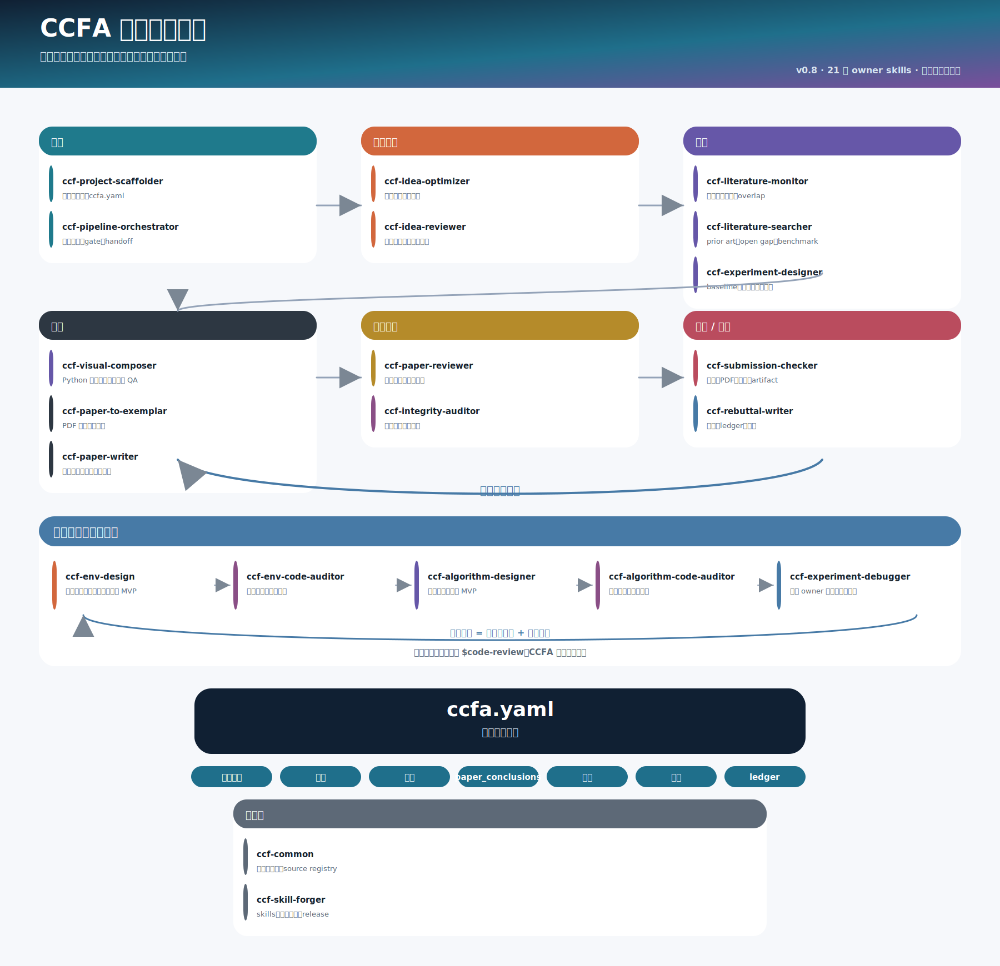
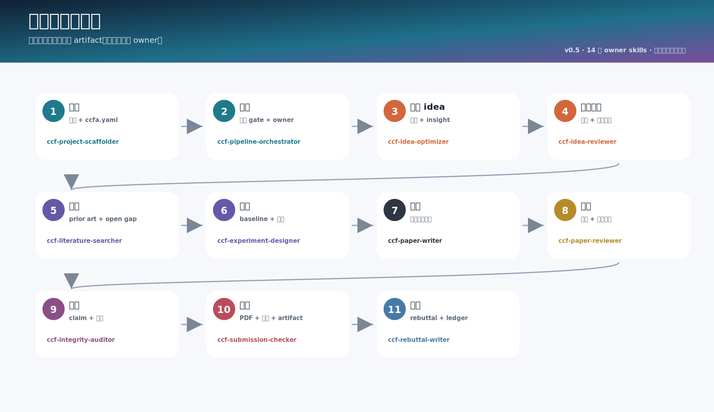
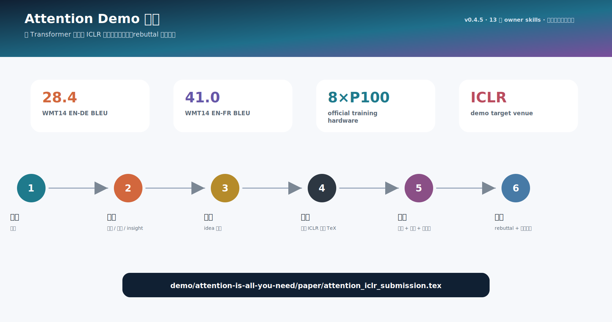
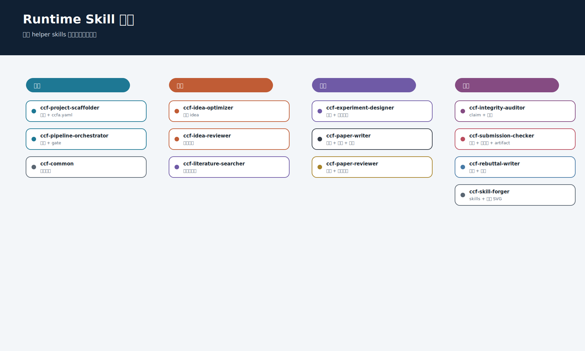
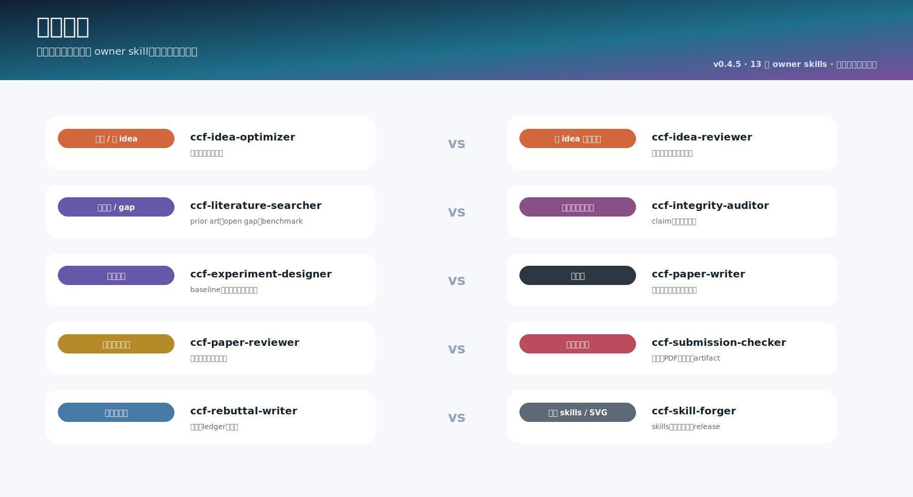
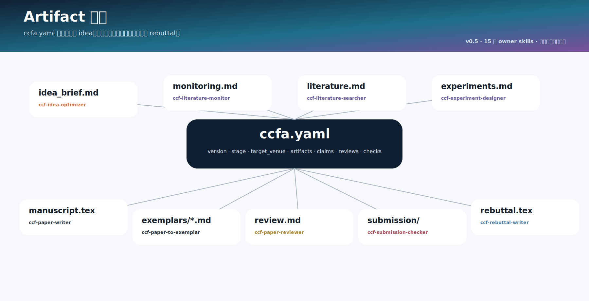
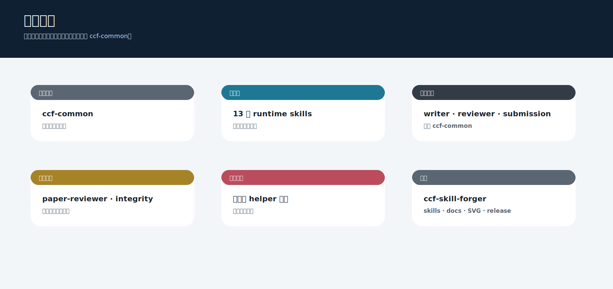
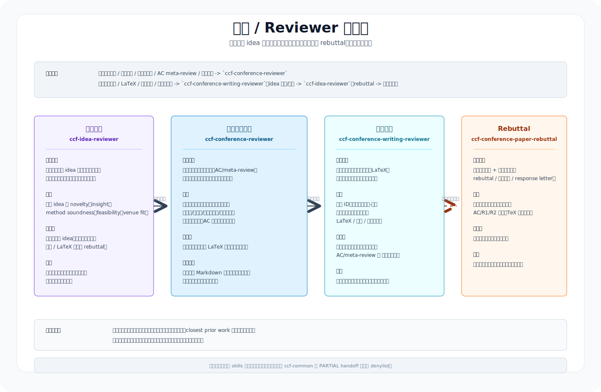

<div align="center">

# CCFA Skills

### 面向 CCF/NeurIPS 论文项目的 `ccf-*` 技能家族。

<p>
  <a href="README.md">English</a> ·
  <strong>简体中文</strong> ·
  <a href="README.zh-TW.md">繁體中文</a>
</p>

</div>

---

CCFA Skills 是一套本地 Codex skills，用来管理论文项目从 idea 到 rebuttal 的完整流程。当前 v0.4 线不再继续堆 helper skills，而是把 runtime 入口收敛到 13 个清晰 owner。压缩、写作评审、引用审计、结果图表、artifact、会议格式、重投、报告展示和文档 SVG 都已经并入对应主 skill。



## 安装

完整安装：

```bash
git clone https://github.com/mikubaka88/CCFA-Skills.git
mkdir -p "$CODEX_HOME/skills"
cp -R CCFA-Skills/ccf-* "$CODEX_HOME/skills/"
```

支持部分安装，但任何子集都必须包含 `ccf-common`：

```bash
skills=(ccf-common ccf-paper-writer ccf-paper-reviewer ccf-submission-checker)
mkdir -p "$CODEX_HOME/skills"
for s in "${skills[@]}"; do cp -R "$s" "$CODEX_HOME/skills/"; done
```

PowerShell：

```powershell
$skills = @("ccf-common", "ccf-paper-writer", "ccf-paper-reviewer", "ccf-submission-checker")
New-Item -ItemType Directory -Force "$env:CODEX_HOME\skills" | Out-Null
foreach ($s in $skills) { Copy-Item -Recurse -Force $s "$env:CODEX_HOME\skills\" }
```

部分安装前请看 [INSTALLATION_MATRIX.zh-CN.md](docs/INSTALLATION_MATRIX.zh-CN.md)。

## 13 个 Runtime Skills

- `ccf-project-scaffolder`：创建项目目录，选择/复制模板，初始化 `ccfa.yaml`。
- `ccf-pipeline-orchestrator`：规划流程、拆任务、定 gate、安排 handoff。
- `ccf-idea-optimizer`：把粗 idea 具象化成问题、gap、insight、方法和证据计划。
- `ccf-idea-reviewer`：对早期 idea 严格评分、比较、排序、取舍。
- `ccf-literature-searcher`：检索相关工作、prior art、数据集、benchmark 和引用证据。
- `ccf-experiment-designer`：设计实验，并基于真实结果生成结果表/图，不编造数字。
- `ccf-paper-writer`：写作、润色、压缩；润色时保留原 Markdown/LaTeX 格式；只有 idea 时可按目标会议 LaTeX 起草，缺省回退 NeurIPS；也能把论文转成 slides/poster/talk/Q&A。
- `ccf-paper-reviewer`：做科学审稿、写作评审、格式表达风险、评分和 AC/meta-review。
- `ccf-integrity-auditor`：审计 claim、数字、图表、引用、BibTeX 和引用上下文支撑。
- `ccf-submission-checker`：检查会议规则、模板页数、匿名、LaTeX/PDF、metadata 和 artifact。
- `ccf-rebuttal-writer`：写 rebuttal、response letter、revision ledger 和保守重投计划。
- `ccf-common`：共享路由、隐私/证据策略、source registry 和 artifact 合约。
- `ccf-skill-forger`：维护 skills、路由、文档、生成式 SVG、校验和 release。

## 家族流程

```text
ccf-project-scaffolder
  -> ccf-pipeline-orchestrator
  -> ccf-idea-optimizer -> ccf-idea-reviewer
  -> ccf-literature-searcher -> ccf-experiment-designer
  -> ccf-paper-writer
  -> ccf-paper-reviewer -> ccf-integrity-auditor
  -> ccf-submission-checker
  -> ccf-rebuttal-writer

治理: ccf-common / ccf-skill-forger
```



## 已合并的 Helper

不要再安装这些旧 runtime：`ccf-workflow-planner`、`ccf-paper-compressor`、`ccf-writing-reviewer`、`ccf-citation-auditor`、`ccf-figure-table-builder`、`ccf-artifact-packager`、`ccf-venue-format-guide`、`ccf-resubmission-adapter`、`ccf-paper-presenter`、`ccf-doc-diagram-designer`。

能力没有删，只是归属更清楚：

- 压缩和报告展示 -> `ccf-paper-writer`
- 写作评审 -> `ccf-paper-reviewer`
- 引用审计 -> `ccf-integrity-auditor`
- 结果图表 -> `ccf-experiment-designer`
- 会议格式和 artifact -> `ccf-submission-checker`
- 重投迁移 -> `ccf-rebuttal-writer`
- 文档 SVG -> `ccf-skill-forger`

## Venue Guides

会议 LaTeX/template 信息是 reference，不是 runtime skill：

```text
ccf-paper-writer/references/venue-guides/index.md
ccf-paper-writer/references/venue-guides/<venue>.md
```

正文写作走 `ccf-paper-writer`，会议合规和投稿包检查走 `ccf-submission-checker`。从 0 写稿时，`ccf-paper-writer` 会先查目标会议 guide；找不到目标会议或没有指定会议时，按 NeurIPS LaTeX 模板起草。

## Demo

`demo/attention-is-all-you-need/` 是完整 NeurIPS 风格 dry run：读取 Transformer 原文，抽取思路，然后逐步使用 CCFA 家族完成 idea 优化、证据/实验规划、写作、审稿、完整性审计、投稿检查和 rebuttal。



## 图示











详细文档见 [SKILLS_CATALOG.md](docs/SKILLS_CATALOG.md)、[ARCHITECTURE.md](docs/ARCHITECTURE.md)、[INSTALLATION_MATRIX.zh-CN.md](docs/INSTALLATION_MATRIX.zh-CN.md)、[NAMING_AND_MERGE_AUDIT.md](docs/NAMING_AND_MERGE_AUDIT.md)。
