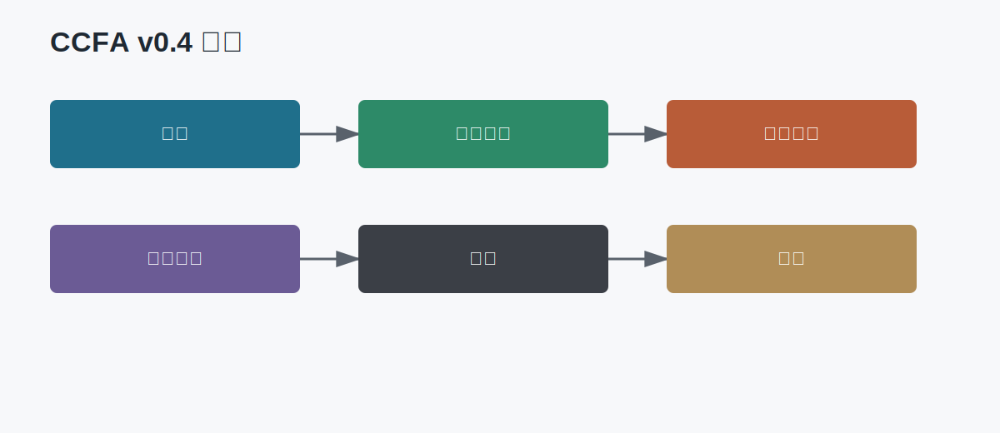
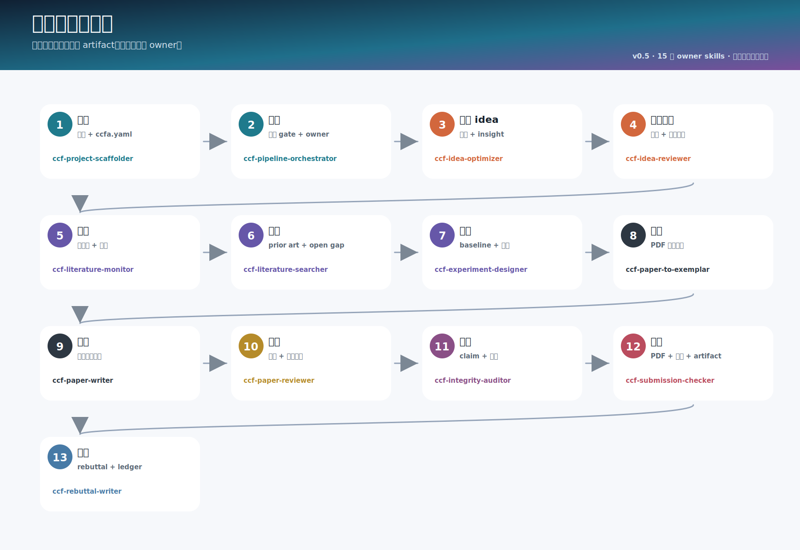
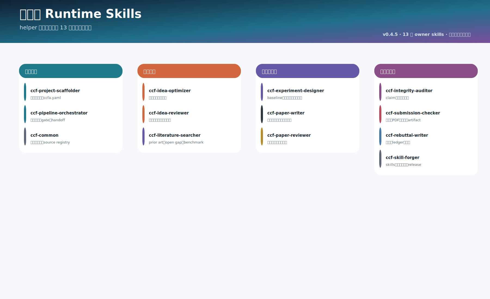
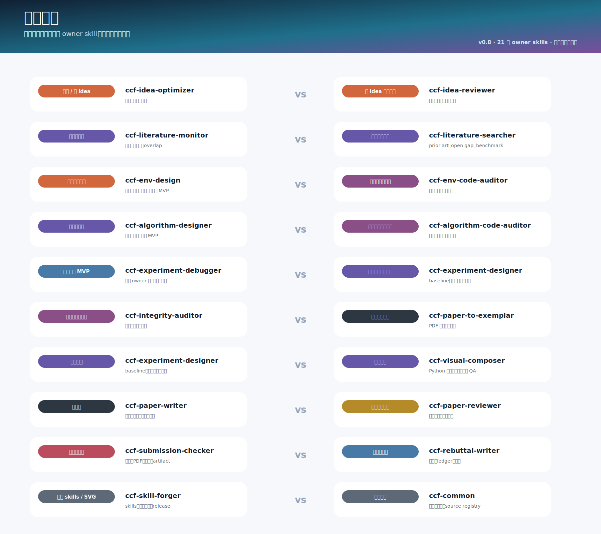
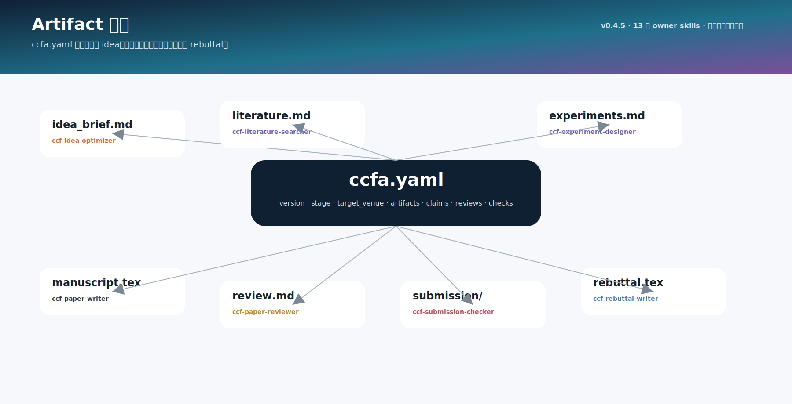
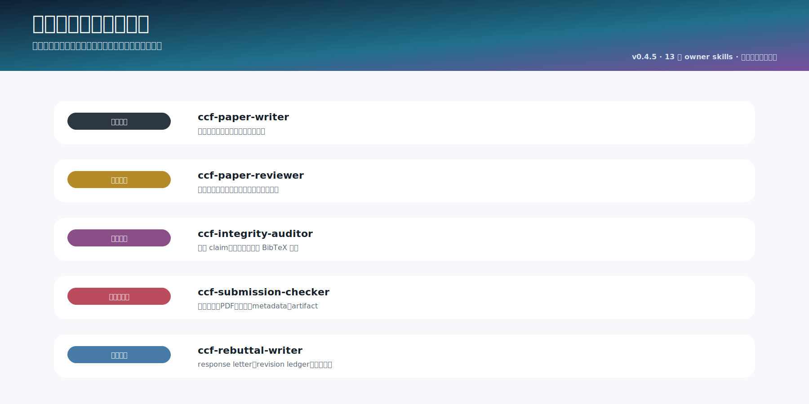

<div align="center">

# CCFA Skills

### 面向 CCF 論文專案的 `ccf-*` 技能家族

<p>
  <a href="README.md">English</a> ·
  <a href="README.zh-CN.md">简体中文</a> ·
  <strong>繁體中文</strong>
</p>

</div>

---

CCFA Skills 是一組本地 Codex skills，用來支撐 CCF 風格論文從立項到投稿後的完整流程：建立專案、釐清路線、打磨 idea、檢索文獻、設計實驗、寫作、審稿、稽核、檢查投稿包、撰寫 rebuttal、重投適配和簡報展示。

這次命名整理後，runtime skills 都採用 `ccf-<對象>-<職責>` 的單數風格；`ccf-common` 是唯一例外，因為它是治理模組，不直接處理一般研究任務。`ccf-revision-ledger` 已合併到 `ccf-rebuttal-writer`，讓審稿意見、回覆承諾、修改位置和完成狀態留在同一個 post-review 入口。



## 安裝

```bash
git clone https://github.com/mikubaka88/CCFA-Skills.git
cp -r CCFA-Skills/ccf-* "$CODEX_HOME/skills/"
```

已有本地倉庫時：

```bash
git pull origin main
cp -r ccf-* "$CODEX_HOME/skills/"
```

倉庫同時提供 `.codex-plugin/plugin.json` 和 `.claude-plugin/plugin.json`。

## 目前 Skills

- `ccf-project-scaffolder`：腳手架：建目錄、選模板、初始化 ccfa.yaml。
- `ccf-pipeline-orchestrator`：編排階段、gate、artifact 與 handoff。
- `ccf-workflow-planner`：澄清目標、範圍、成功標準與下一步 skill。
- `ccf-idea-optimizer`：把粗 idea 具象化成問題、gap、insight、方法和證據計畫。
- `ccf-idea-reviewer`：嚴格評分、排序、比較早期 idea。
- `ccf-literature-searcher`：檢索相關工作、prior art、資料集和 benchmark。
- `ccf-experiment-designer`：設計資料集、baseline、指標、消融、魯棒性和結果表模板。
- `ccf-paper-writer`：寫作、潤飾、重組論文正文，並保護既有 idea 和證據邊界。
- `ccf-paper-compressor`：在不改 claims/results 的前提下壓縮篇幅。
- `ccf-scientific-reviewer`：做完整科學審稿、評分、模擬 reviewer 和 AC/meta-review。
- `ccf-writing-reviewer`：評審段落邏輯、表達清晰度、一致性、LaTeX/格式和展示風險。
- `ccf-integrity-auditor`：稽核 claim-support、結果到 claim、數字、術語和圖表一致性。
- `ccf-citation-auditor`：核驗已有引用、BibTeX metadata、文獻存在性和引用上下文支撐。
- `ccf-figure-table-builder`：基於真實結果建構和稽核圖、表、caption、SVG/PDF。
- `ccf-artifact-packager`：準備 artifact/reproducibility 包、環境、seed、license 和 README。
- `ccf-venue-format-guide`：回答會議 LaTeX、template、頁數、匿名和 camera-ready 格式問題。
- `ccf-submission-checker`：檢查 LaTeX/PDF、頁數、匿名、字型、metadata、template 和 policy freshness。
- `ccf-rebuttal-writer`：寫 rebuttal、作者回覆、response letter、修改說明和 revision ledger。
- `ccf-resubmission-adapter`：把已有論文保守遷移到新 venue，預設不新增實驗、不改 bib。
- `ccf-paper-presenter`：把論文轉成 slides、poster、talk script、圖表講解和 Q&A。
- `ccf-common`：共享路由、觸發註冊、handoff、source registry、隱私策略和 artifact 合約。
- `ccf-skill-forger`：建立、更新、校驗和稽核 CCFA/Codex skills 及家族治理。

## 家族關係

```text
ccf-project-scaffolder -> ccf-pipeline-orchestrator -> ccf-workflow-planner
  -> ccf-idea-optimizer -> ccf-idea-reviewer
  -> ccf-literature-searcher -> ccf-experiment-designer
  -> ccf-paper-writer -> ccf-paper-compressor
  -> ccf-scientific-reviewer / ccf-writing-reviewer
  -> ccf-integrity-auditor / ccf-citation-auditor
  -> ccf-figure-table-builder / ccf-artifact-packager
  -> ccf-venue-format-guide / ccf-submission-checker
  -> ccf-rebuttal-writer / ccf-resubmission-adapter / ccf-paper-presenter
```



## Venue 分支

舊的逐會議 runtime skills 已遷移為參考資料：

```text
ccf-paper-writer/references/venue-guides/index.md
ccf-paper-writer/references/venue-guides/<venue>.md
```

會議格式問題交給 `ccf-venue-format-guide`；正文寫作交給 `ccf-paper-writer`；寫作/格式評審交給 `ccf-writing-reviewer`；真實投稿包檢查交給 `ccf-submission-checker`。

## 重命名與合併

- `ccf-brainstorming` -> `ccf-workflow-planner`：凸顯「規劃與路由」職責，避免和通用 brainstorming 混在一起。
- `ccf-literature-search` -> `ccf-literature-searcher`：從動作名改為職責名，和 auditor/designer/writer 的風格一致。
- `ccf-writing-skills` -> `ccf-paper-writer`：拿掉泛化的 `skills` 尾綴，明確它是論文正文寫作入口。
- `ccf-conference-reviewer` -> `ccf-scientific-reviewer`：強調這是科學審稿，不再把 venue 層誤認為審稿邊界。
- `ccf-conference-writing-reviewer` -> `ccf-writing-reviewer`：保留寫作評審職責，並與科學審稿分開。
- `ccf-conference-paper-rebuttal` -> `ccf-rebuttal-writer`：直接命名為 rebuttal/author response 的產出職責。
- `ccf-conference-guides` -> `ccf-venue-format-guide`：明確它只處理會議格式、模板、匿名和頁數規則。
- `ccf-paper-project-scaffold` -> `ccf-project-scaffolder`：改為清楚的專案腳手架職責名。
- `ccf-artifact-reproducibility` -> `ccf-artifact-packager`：凸顯 artifact/reproducibility 包的準備與交付。
- `ccf-revision-ledger` -> `merged into ccf-rebuttal-writer`：ledger 屬於審後回覆追蹤，合併後能避免 rebuttal 觸發衝突。
- `ccf-paper-talk` -> `ccf-paper-presenter`：凸顯 slides、poster、talk 和 Q&A 的展示產出。
- `ccf-forge-skills` -> `ccf-skill-forger`：避免 `skills` 尾綴造成「技能家族本身」的歧義。

## 圖譜









更完整的觸發邊界、架構關係和合併理由見 `docs/SKILLS_CATALOG.md`、`docs/ARCHITECTURE.md`、`docs/NAMING_AND_MERGE_AUDIT.md`。
