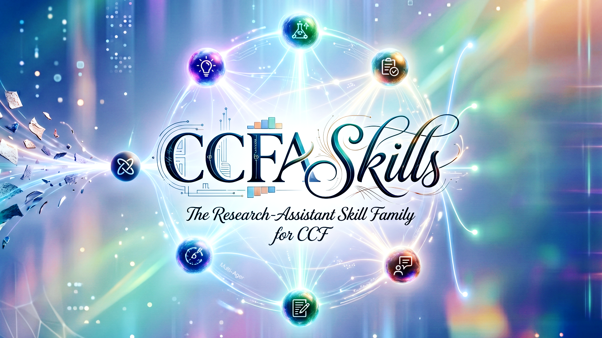
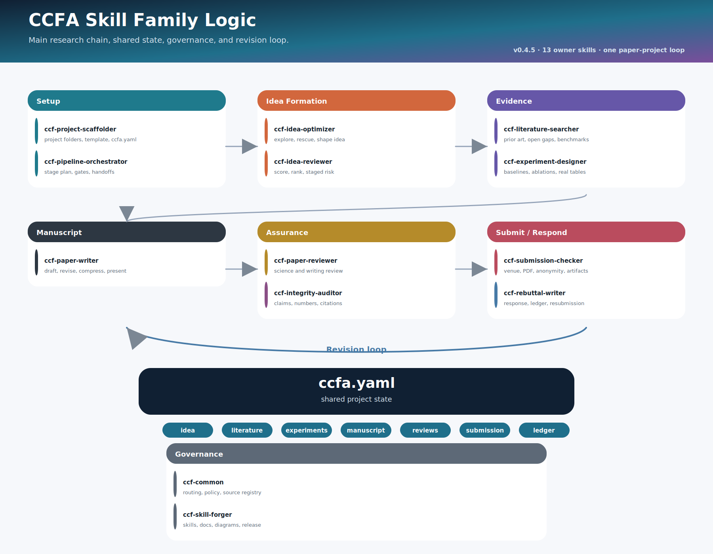

<div align="center">

# CCFA Skills

### 一個面向 CCF-A 研究選題、文獻檢索、實驗設計、論文建構、審稿模擬與作者回應的研究輔助 skill 家族。

<p>
  <a href="README.md">English</a> ·
  <a href="README.zh-CN.md">简体中文</a> ·
  <strong>繁體中文</strong>
</p>

</div>

---

<p align="center">
  
</p>

## 專案定位

CCFA Skills 是一組面向 CCF-A 學術研究流程的 agent-readable research skills。它關注的是從非正式 idea 到可辯護投稿之間的關鍵階段：澄清問題、形成方法、聯網檢索並評分相關文獻、校準新穎性、設計證據、組織和壓縮論文、預判審稿，以及在審稿後進行回應。

這個倉庫不希望被綁定到某一個模型或互動介面。文件採用基於 `SKILL.md` 的組織方式，可用於支援本地 skill 模組的 agent 環境。倉庫中保留了一些便於 Codex-style 環境識別的 metadata，但核心內容是可遷移的研究流程：Markdown workflow、rubric、checklist、venue adapter、模板和參考說明。

## 研究前提

許多研究專案的問題並不是在寫作階段才出現的。真正不穩定的，往往是更早的研究鏈條：

```text
問題 -> 缺口 -> 挑戰 -> 洞察 -> 方法 -> 證據 -> 主張
```

當其中某一環薄弱時，後續潤色常常只是把問題隱藏起來，而不是解決它。模糊的 gap 會變成模糊的引言；缺少機制的方法會變成元件列表；不能檢驗中心主張的實驗會變成難以防守的表格。

CCFA Skills 的組織方式正好相反：儘早暴露薄弱環節，精確命名它，並把它轉化為下一步研究行動。它的學術立場是克制的：有根據的新穎性優先於裝飾性敘述，機制優先於術語，證據優先於強調，有邊界的主張優先於流暢卻越界的表達。

## 系統架構

這個家族按照研究流程分層組織。

| 層級 | 目的 | Skills |
| --- | --- | --- |
| **Idea Layer** | 在寫作前塑形並評估研究方向。 | `ccf-idea-optimizer`, `ccf-idea-reviewer` |
| **Evidence Layer** | 檢索高品質文獻並設計不偽造結果的實驗方案。 | `ccf-literature-search`, `ccf-experiment-designer` |
| **Manuscript Layer** | 將可行方向發展為連貫的 CCF-A 論文，並按篇幅限制壓縮。 | `ccf-writing-skills`, `ccf-paper-compressor` |
| **Review Layer** | 在投稿前模擬 reviewer 和 AC 壓力。 | `ccf-conference-paper-reviewer` |
| **Response Layer** | 將審稿意見轉化為清晰回應和修改承諾。 | `ccf-conference-paper-rebuttal` |
| **Maintenance Layer** | 建立、改進、校驗和治理 skill 模組。 | `forge-skills`, `ccf-common` |

推薦的使用方式不是自由跳轉，而是明確路由。`ccf-common/references/routing.md` 定義每類任務的歸屬，避免 idea 優化、idea 評分、文獻檢索、實驗設計、論文寫作、篇幅壓縮、完整審稿、rebuttal 和 skill 維護互相搶觸發。

跨 skill handoff 由 `metadata.ccf_skill_controls.handoff_question_mode` 控制：

- **PARTIAL (Recommended)：** 只在跨研究階段、可能改變 idea scope、進入正式 reviewer/rebuttal 模組、聯網處理敏感材料、或生成可複用文件時詢問。
- **FULL：** 任何可選 sibling-skill handoff 前都詢問。
- **OFF：** 不詢問，按路由自動使用需要的 sibling skill；仍然尊重使用者 denylist 和 writing-only 的 idea-scope 保護。

```text
raw idea
  -> ccf-idea-optimizer                           ：問題 / 方法 / 證據成形
  -> ccf-idea-reviewer                            ：當使用者要求評分/排序時做問題-方法門控
  -> ccf-literature-search                        ：需要當前文獻、資料集或 benchmark 時使用
  -> ccf-experiment-designer                      ：設計 baseline / ablation / 結果填寫表
       如果薄弱但可修復且 handoff 允許            ：回到 optimizer 做定向修復
       如果根本不匹配                            ：pivot 或停止投入
       如果已經可發展且 handoff 允許             ：進入寫作模組

writing request
  -> ccf-writing-skills                           ：預設 writing-only
       修改 idea scope 需要明確確認              ：否則只標註 Idea-level risk
       篇幅/頁數壓縮按 handoff mode 執行          ：ccf-paper-compressor
       完整論文 review 按 handoff mode 執行       ：ccf-conference-paper-reviewer

使用者明確要求 rebuttal 或真實審稿意見到來
  -> ccf-conference-paper-rebuttal                ：作者回應和修改承諾
       改論文或做 review-risk 診斷               ：按 handoff mode 執行
```

**Writing-only mode。** `ccf-writing-skills` 預設不修改研究主題、核心問題、方法機制、實驗設定、結果數值和結論方向。它只改表達、結構、故事線、claim-evidence 對齊和 reviewer-facing 包裝。即使 idea 修改看起來有幫助，也必須先得到明確確認。

**Session denylist。** 如果使用者說不使用某個 skill，該 skill 在目前對話中就被禁用。助手不能繞過這個決定去模擬被禁用模組；只能使用本模組內部 fallback，例如 compact risk scan、action queue 或 writing-only checklist。

**Task modes。** CCFA Skills 支援 `quick` 和 `standard` 兩種模式。`quick` 用於單段潤色、局部風險檢查、小規模文獻 sanity scan、快速實驗草圖或局部壓縮，不強制完整 checklist。`standard` 是完整章節、整篇論文 review、文獻檢索資料夾、實驗方案、score-risk loop 和可複用文件的預設模式。

因此，第二次出現 `ccf-idea-optimizer` 不是重複。第一次 optimizer 負責把粗糙方向整理到「可以被判斷」的狀態；後續在 reviewer 診斷後，只有 handoff mode 允許時才會進入定向修復。`ccf-conference-paper-rebuttal` 被隔離在預設投稿前閉環之外，只有使用者明確要求 rebuttal、作者回應、response letter 或審稿意見回覆時才使用。

<p align="center">
  
</p>

這個結構重要，是因為 CCF-A 審稿並不是一個單一分數，而是新穎性、重要性、可靠性、證據、清晰度、可復現性和 venue fit 之間的綜合判斷。CCFA Skills 將這些維度拆開處理，同時保留它們之間的依賴關係。

## Skill 家族

### `ccf-idea-optimizer`

將早期研究方向轉化為結構化 idea card：任務、gap、根本挑戰、核心洞察、方法機制、貢獻類型、證據計畫和風險登記表。

它適合處理「有潛力但尚未成形」的想法。這個 skill 會追問：專案真正想證明什麼，方法依賴什麼假設，什麼證據能讓主張可信，以及哪個學術共同體會認為這項工作有意義。

### `ccf-idea-reviewer`

在論文尚未形成之前，只評價問題和方法。它使用多個專家視角，包括領域、方法、實驗、venue 和 skeptical prior-art 視角。

它的目標不是獎勵自信表達，而是區分低新穎性與未知新穎性，區分可行性風險與 framing 風險，也區分可修復設計問題與需要 pivot 的根本原因。這個階段給 idea 做的是研究層面的診斷。

### `ccf-literature-search`

聯網檢索高品質文獻，按策略排除 MDPI，分類 paper type，評分文章品質，並寫入包含標題、連結、評分、文章類型和備註的 literature-search 資料夾。

它主要聯動 Related Work、Introduction、idea 優化、idea 評審、實驗設計和 reviewer-risk 診斷。純 benchmark 論文會單獨標記，而不是按方法論文標準扣分。

### `ccf-experiment-designer`

設計 CCF-A 實驗證據包：資料集、benchmark、baseline、ablation、metric、robustness test、failure analysis 和結果填寫表。

它禁止偽造實驗結果。缺少數值時，只提供給使用者填寫的表格模板，並標註每個實驗回答哪個 reviewer 問題。

### `ccf-writing-skills`

將成熟 idea 發展為論文級論證。它處理故事線、章節規劃、段落角色、claim-evidence map、venue adaptation、樣例啟發式寫作策略和 score-risk 修改。

它最重視一致性：摘要、引言、方法、實驗、侷限性和結論應該以不同解析度講述同一個研究故事。

### `ccf-paper-compressor`

按照頁數或字數目標壓縮論文段落、章節或全文，同時保護故事線、主張、證據、結果數值和侷限性。

它可以用 quick mode 做局部壓縮，也可以用 standard mode 做整節或整篇壓縮。涉及「放附錄還是刪除」的策略選擇時，它會詢問一次，然後一致執行。

### `ccf-conference-paper-reviewer`

模擬嚴格但公平的 conference review。它以 program committee 的判斷距離閱讀論文，識別可能扣分點，校準分數，並將弱點轉化為修改行動。

它使投稿前審查更可執行：哪些問題可以通過寫作修復，哪些需要分析，哪些需要新結果，哪些應被界定為侷限，哪些說明 venue 不匹配。

### `ccf-conference-paper-rebuttal`

支援審稿後的作者回應。它將審稿意見整理為 issue table，合併 common concerns，選擇回應策略，起草簡潔回覆，並可配合 TeX response templates。

它的原則是 evidence-grounded communication：回答關切，澄清誤解，承認有效邊界，避免不可兌現的承諾。

### `forge-skills`

提供構建和維護 skills 的工程層。它覆蓋命名、結構、資源組織、校驗和觸發設計。

它讓這個家族保持可擴展：新的領域 skill 可以被加入，而不需要把整個倉庫變成一個巨大的 prompt 文件。

### `ccf-common`

提供 CCFA 家族的共享控制層，包括路由、handoff 模式、私有材料安全、source registry 和 venue-family map。它不是普通研究寫作 skill，而是由維護者和兄弟 skill 載入，用來保持行為一致。

## 這個家族優化什麼

| 目標 | 含義 |
| --- | --- |
| **問題精度** | 論文應命名真實瓶頸，而不只是說明現有方法不足。 |
| **機制清晰度** | 方法應解釋為什麼有效，而不只是列出元件。 |
| **新穎性校準** | 原創性主張應與相近工作對照；未檢索時應標記不確定性。 |
| **證據對齊** | 實驗、證明、使用者研究或系統評估應檢驗中心主張。 |
| **Venue fit** | 論證方式應能被目標學術共同體理解和評價。 |
| **修改連續性** | 批評應轉化為 action queue，而不是零散建議。 |

## 安裝

請複製完整 skill 目錄，而不只是複製 `SKILL.md`。多個模組依賴 `references/`、`assets/`、模板以及跨 skill 的相對路徑引用。可安裝的目錄包括：

```text
ccf-idea-optimizer
ccf-idea-reviewer
ccf-literature-search
ccf-experiment-designer
ccf-writing-skills
ccf-paper-compressor
ccf-conference-paper-reviewer
ccf-conference-paper-rebuttal
ccf-common
forge-skills
```

### 1. Codex

Codex-style 本地 skill 環境通常從 `~/.codex/skills/` 讀取 skills。如果你使用自訂 `$CODEX_HOME`，請把這些目錄放到 `$CODEX_HOME/skills/` 下面。

macOS / Linux：

```bash
git clone https://github.com/mikubaka88/CCFA-Skills.git
cd CCFA-Skills
mkdir -p ~/.codex/skills
cp -R ccf-* forge-skills ~/.codex/skills/
```

Windows PowerShell：

```powershell
git clone https://github.com/mikubaka88/CCFA-Skills.git
Set-Location .\CCFA-Skills
New-Item -ItemType Directory -Force "$HOME\.codex\skills" | Out-Null
Copy-Item -Recurse -Force .\ccf-* "$HOME\.codex\skills\"
Copy-Item -Recurse -Force .\forge-skills "$HOME\.codex\skills\"
```

複製完成後建議重新開啟一個會話。可以用這句話快速測試：`Use ccf-idea-optimizer to refine this rough research idea...`

### 2. Claude Code

Claude Code 可以從使用者級 skills 目錄或專案級 skills 目錄載入 skills。希望所有專案都能使用時，推薦使用者級安裝；如果某個論文專案希望自帶固定研究流程，則使用專案級安裝。

使用者級安裝：

```bash
git clone https://github.com/mikubaka88/CCFA-Skills.git
cd CCFA-Skills
mkdir -p ~/.claude/skills
cp -R ccf-* forge-skills ~/.claude/skills/
```

專案級安裝：

```bash
git clone https://github.com/mikubaka88/CCFA-Skills.git
mkdir -p your-paper-repo/.claude/skills
cp -R CCFA-Skills/ccf-* CCFA-Skills/forge-skills your-paper-repo/.claude/skills/
```

Windows PowerShell：

```powershell
git clone https://github.com/mikubaka88/CCFA-Skills.git
Set-Location .\CCFA-Skills
New-Item -ItemType Directory -Force "$HOME\.claude\skills" | Out-Null
Copy-Item -Recurse -Force .\ccf-* "$HOME\.claude\skills\"
Copy-Item -Recurse -Force .\forge-skills "$HOME\.claude\skills\"
```

安裝後可以直接按名稱呼叫，例如 `/ccf-idea-reviewer`，也可以用自然語言要求 Claude Code 使用對應的 CCFA skill。如果新加入的 skill 目錄沒有被識別，重啟 Claude Code 即可。

如果你希望使用更強的 subagent 隔離，也可以建立 Claude Code subagent wrapper 指向這些已安裝 skill 目錄，但 `SKILL.md` 和對應的 `references/` 應保持為唯一的知識源。

### 3. Other agents or manual use

對於其他 agent 框架，請將同樣的目錄複製到該框架的 skill、tool、memory 或 instruction 目錄，並保持相對路徑不變。每個模組都應以對應目錄下的 `SKILL.md` 作為入口文件。

如果框架沒有原生 skill 系統，也可以手動使用：

```text
1. 根據任務選擇對應目錄。
2. 先閱讀該目錄下的 SKILL.md。
3. 當 SKILL.md 提到 references/... 或 assets/... 時，在同一個 skill 目錄內解析路徑。
4. 當它提到 ../ccf-writing-skills/... 或其他同級 skill 時，保持倉庫原有目錄結構。
5. 只載入當前任務真正需要的引用文件。
```

後續更新時，在本地 clone 目錄中執行 `git pull`，然後重新複製這些 skill 目錄即可。

## 範例請求

```text
Use ccf-idea-optimizer to refine this rough CVPR idea into a problem-method-evidence plan.
Use ccf-idea-reviewer to rank these NeurIPS directions and identify fatal risks.
Use ccf-literature-search to find and score high-quality related work for my Introduction.
Use ccf-experiment-designer to design datasets, baselines, ablations, and result-fill tables.
Use ccf-writing-skills to rebuild my introduction around the actual contribution.
Use ccf-paper-compressor to reduce this Related Work section to 800 words.
Use ccf-conference-paper-reviewer to simulate CCF-A reviewers before submission.
Use ccf-conference-paper-rebuttal to draft a concise response from these reviews.
```

## 邊界

CCFA Skills 不保證錄用，不替代真實實驗，不偽造證據，也不能代替領域專家判斷。它更像一個結構化研究伴侶：幫助研究者暴露薄弱假設，組織決策，校準主張，並讓工作持續對目標學術共同體的標準負責。

## 交流

更多更新、範例和研究札記會整理到小紅書號：`8994074380`。
