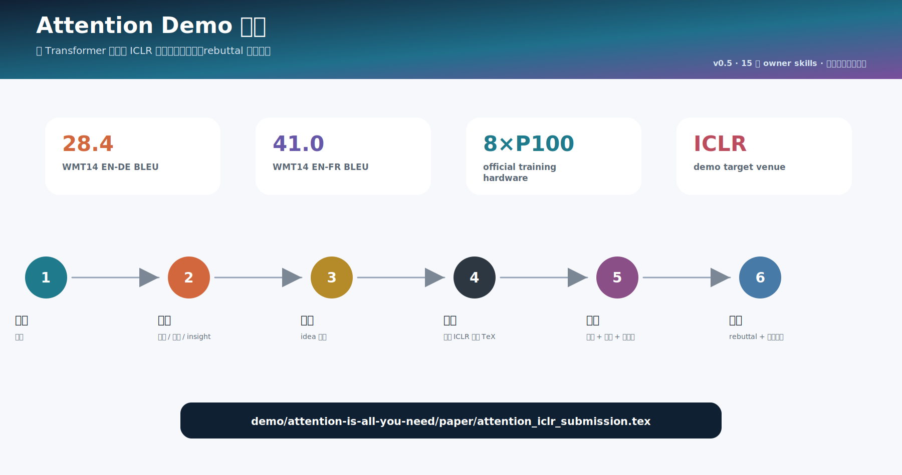
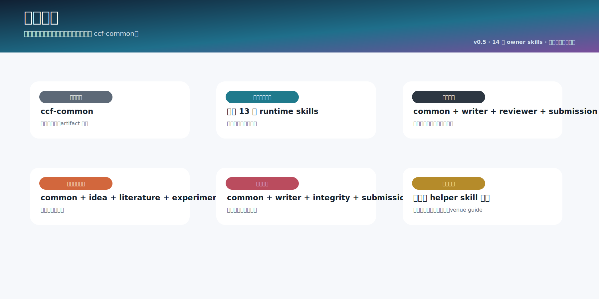

<div align="center">

# CCFA Skills

### 面向 CCF/NeurIPS 論文專案的 `ccf-*` 技能家族。

<p>
  <a href="README.md">English</a> ·
  <a href="README.zh-CN.md">简体中文</a> ·
  <strong>繁體中文</strong>
</p>

</div>

---

CCFA Skills 是一套本地 Codex skills，用來管理論文專案從 idea 到 rebuttal 的完整流程。當前 v0.4 線不再繼續堆 helper skills，而是把 runtime 入口收斂到 13 個清晰 owner。壓縮、寫作評審、引用稽核、結果圖表、artifact、會議格式、重投、報告展示和文件 SVG 都已經併入對應主 skill。


## 安裝

完整安裝：

```bash
git clone https://github.com/mikubaka88/CCFA-Skills.git
mkdir -p "$CODEX_HOME/skills"
cp -R CCFA-Skills/ccf-* "$CODEX_HOME/skills/"
```

支援部分安裝，但任何子集都必須包含 `ccf-common`：

```bash
skills=(ccf-common ccf-paper-writer ccf-paper-reviewer ccf-submission-checker)
mkdir -p "$CODEX_HOME/skills"
for s in "${skills[@]}"; do cp -R "$s" "$CODEX_HOME/skills/"; done
```

PowerShell：

```powershell
$skills = @("ccf-common", "ccf-paper-writer", "ccf-paper-reviewer", "ccf-submission-checker")
New-Item -ItemType Directory -Force "$env:CODEX_HOME\skills" | Out-Null
foreach ($s in $skills) { Copy-Item -Recurse -Force $s "$env:CODEX_HOME\skills\" }
```

部分安裝前請看 [INSTALLATION_MATRIX.zh-TW.md](docs/INSTALLATION_MATRIX.zh-TW.md)。

## 13 個 Runtime Skills

- `ccf-project-scaffolder`：建立專案目錄，選擇/複製模板，初始化 `ccfa.yaml`。
- `ccf-pipeline-orchestrator`：規劃流程、拆任務、定 gate、安排 handoff。
- `ccf-idea-optimizer`：把粗 idea 具體化成問題、gap、insight、方法和證據計畫。
- `ccf-idea-reviewer`：對早期 idea 嚴格評分、比較、排序、取捨。
- `ccf-literature-searcher`：檢索相關工作、prior art、資料集、benchmark 和引用證據。
- `ccf-experiment-designer`：設計實驗，並基於真實結果生成結果表/圖，不編造數字。
- `ccf-paper-writer`：寫作、潤飾、壓縮；潤飾時保留原 Markdown/LaTeX 格式；只有 idea 時可按目標會議 LaTeX 起草，缺省回退 NeurIPS；也能把論文轉成 slides/poster/talk/Q&A。
- `ccf-paper-reviewer`：做科學審稿、寫作評審、格式表達風險、評分和 AC/meta-review。
- `ccf-integrity-auditor`：稽核 claim、數字、圖表、引用、BibTeX 和引用上下文支撐。
- `ccf-submission-checker`：檢查會議規則、模板頁數、匿名、LaTeX/PDF、metadata 和 artifact。
- `ccf-rebuttal-writer`：寫 rebuttal、response letter、revision ledger 和保守重投計畫。
- `ccf-common`：共享路由、隱私/證據策略、source registry 和 artifact 合約。
- `ccf-skill-forger`：維護 skills、路由、文件、生成式 SVG、校驗和 release。

## 家族流程

```text
ccf-project-scaffolder
  -> ccf-pipeline-orchestrator
  -> ccf-idea-optimizer -> ccf-idea-reviewer
  -> ccf-literature-searcher -> ccf-experiment-designer
  -> ccf-paper-writer
  -> ccf-paper-reviewer -> ccf-integrity-auditor
  -> ccf-submission-checker
  -> ccf-rebuttal-writer

治理: ccf-common / ccf-skill-forger
```


## 已合併的 Helper

不要再安裝這些舊 runtime：`ccf-workflow-planner`、`ccf-paper-compressor`、`ccf-writing-reviewer`、`ccf-citation-auditor`、`ccf-figure-table-builder`、`ccf-artifact-packager`、`ccf-venue-format-guide`、`ccf-resubmission-adapter`、`ccf-paper-presenter`、`ccf-doc-diagram-designer`。

能力沒有刪，只是歸屬更清楚：

- 壓縮和報告展示 -> `ccf-paper-writer`
- 寫作評審 -> `ccf-paper-reviewer`
- 引用稽核 -> `ccf-integrity-auditor`
- 結果圖表 -> `ccf-experiment-designer`
- 會議格式和 artifact -> `ccf-submission-checker`
- 重投遷移 -> `ccf-rebuttal-writer`
- 文件 SVG -> `ccf-skill-forger`

## Venue Guides

會議 LaTeX/template 資訊是 reference，不是 runtime skill：

```text
ccf-paper-writer/references/venue-guides/index.md
ccf-paper-writer/references/venue-guides/<venue>.md
```

正文寫作走 `ccf-paper-writer`，會議合規和投稿包檢查走 `ccf-submission-checker`。從 0 寫稿時，`ccf-paper-writer` 會先查目標會議 guide；找不到目標會議或沒有指定會議時，按 NeurIPS LaTeX 模板起草。

## Demo

`demo/attention-is-all-you-need/` 是完整 NeurIPS 風格 dry run：讀取 Transformer 原文，抽取思路，然後逐步使用 CCFA 家族完成 idea 優化、證據/實驗規劃、寫作、審稿、完整性稽核、投稿檢查和 rebuttal。



## 圖示





詳細文件見 [SKILLS_CATALOG.md](docs/SKILLS_CATALOG.md)、[ARCHITECTURE.md](docs/ARCHITECTURE.md)、[INSTALLATION_MATRIX.zh-TW.md](docs/INSTALLATION_MATRIX.zh-TW.md)、[NAMING_AND_MERGE_AUDIT.md](docs/NAMING_AND_MERGE_AUDIT.md)。
